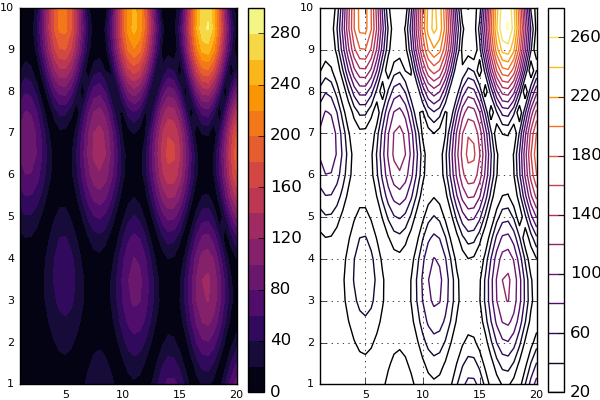
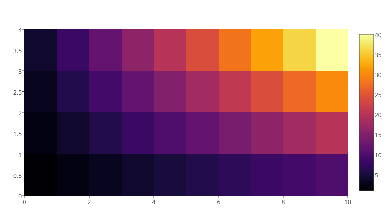
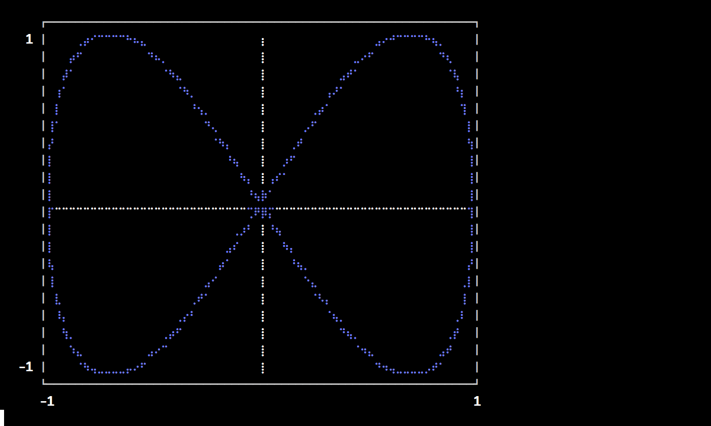
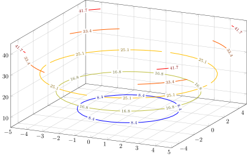
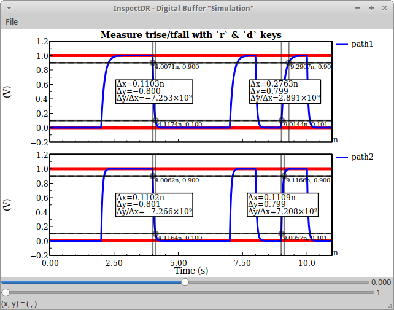

# Backends

Backends are the lifeblood of Plots, and the diversity between features, approaches, and strengths/weaknesses was 
one of the primary reasons that I started this package.

For those who haven't had the pleasure of hacking on 15 different plotting APIs:  First, consider yourself lucky.  However,
you will probably have a hard time choosing the right backend for your task at hand.  This document is meant to be a guide and 
introduction to making that choice.

# For the impatient

My favorites: GR for speed, Plotly(JS) for interactivity, PyPlot otherwise.

If you require... | ... then use...
----------- | -----------------
features         | PyPlot, Plotly(JS), GR
speed            | GR, InspectDR
interactivity    | Plotly(JS), InspectDR
beauty           | Plotly(JS), PGFPlots
REPL Plotting    | UnicodePlots
3D plots  		 | PyPlot, GR, Plotly(JS)
a GUI Window     | GR, PyPlot, PlotlyJS, InspectDR
a small footprint | UnicodePlots, Plotly

Of course nothing in life is that simple.  Likely there are subtle tradeoffs between backends, long hidden bugs, and more excitement.  Don't be shy to try out something new!

---

### [PyPlot](https://github.com/stevengj/PyPlot.jl)

A Julia wrapper around the popular python package PyPlot (Matplotlib).  It uses PyCall.jl to pass data with minimal overhead.

Pros:

- Tons of functionality
- 2D and 3D
- Mature library
- Standalone or inline
- Well supported in Plots

Cons:

- Uses python
- Dependencies frequently cause setup issues
- Inconsistent output depending on Matplotlib version

Primary author: Steven G Johnson (@stevengj)

### [Plotly / PlotlyJS](https://github.com/spencerlyon2/PlotlyJS.jl)

These are treated as separate backends, though they share much of the code and use the Plotly javascript API.  `plotly()` is the only dependency-free plotting option,
as the required javascript is bundled with Plots.  It can create inline plots in IJulia, or open standalone browser windows when run from the Julia REPL.

`plotlyjs()` is the preferred option, and taps into the great functionality of Spencer Lyon's PlotlyJS.jl.  Inline IJulia plots can be updated from any cell... something that
makes this backend stand out.  From the Julia REPL, it taps into Blink.jl and Electron to plot within a standalone GUI window... also very cool. Also, PlotlyJS supports saving the output to more formats than Plotly, such as EPS and PDF, and thus is the recommended version of Plotly for developing publication-quality figures.

Pros:

- [Tons of functionality](https://plot.ly/javascript/)
- 2D and 3D
- Mature library
- Interactivity (even when inline)
- Standalone or inline

Cons:

- No custom shapes
- JSON may limit performance

Primary PlotlyJS.jl author: Spencer Lyon (@spencerlyon2)

### [GR](https://github.com/jheinen/GR.jl)

Super fast with lots of plot types.  Still actively developed and improving daily.

Pros:

- Speed
- 2D and 3D
- Standalone or inline

Cons:

- Limited interactivity
- Plots integration is still a work in progress

Primary author: Josef Heinen (@jheinen)

### [UnicodePlots](https://github.com/Evizero/UnicodePlots.jl)

Simple and lightweight.  Plot directly in your terminal.  You won't produce anything publication quality, but for a quick look at your data it is awesome.

Pros:

- Minimal dependencies
- Lightweight
- Fast
- REPL plotting

Cons:

- Limited functionality

Primary author: Christof Stocker (@Evizero)

### [PGFPlots](https://github.com/sisl/PGFPlots.jl)

LaTeX plotting, based on PGF/TikZ.

Pros:

- Nice looking plots
- Lots of functionality (though the code is still WIP)

Cons:

- Tricky to install
- Heavy-weight dependencies

Authors:

- PGFPlots: Christian Feuersanger
- PGFPlots.jl: Mykel Kochenderfer (@mykelk),  Louis Dressel (@dressel), and others
- Plots <--> PGFPlots link code: Patrick Kofod Mogensen (@pkofod)

### [InspectDR](https://github.com/ma-laforge/InspectDR.jl)

Fast plotting with a responsive GUI (optional).  Target: Quickly identify design/simulation issues & glitches in order to shorten design iterations.

 

Pros:

- Relatively short load times / time to first plot
- Interactive mouse/keybindings
 - Fast & simple way to pan/zoom into data
- Designed with larger datasets in mind
 - Responsive even with moderate (>200k points) datasets
 - Confirmed to handle 2GB datsets with reasonable speed on older desktop running Windows 7 (drag+pan of data area highly discouraged).

Cons:

- Mostly limited to 2D line/scatter plots

Primary author: MA Laforge (@ma-laforge)

---

# The future: works in progress

### [GLVisualize](https://github.com/JuliaGL/GLVisualize.jl)

A really awesome 2D/3D visualization library written in Julia and OpenGL.  It is feature-packed and fast, and author Simon Danisch has put a ton of energy into its development.  I'm very excited for the day that this is cleanly wrapped.

---

# Deprecated backends

### [Gadfly](https://github.com/dcjones/Gadfly.jl)

A Julia implementation inspired by the "Grammar of Graphics".

Pros:

- Clean look
- Lots of features
- Flexible when combined with Compose.jl (inset plots, etc)

Cons:

- Do not support 3D
- Slow time-to-first-plot
- Lots of dependencies
- No interactivity

Primary author: Daniel C Jones

### [Immerse](https://github.com/JuliaGraphics/Immerse.jl)

Built on top of Gadfly, Immerse adds some interactivity and a standalone GUI window, including zoom/pan and a cool "point lasso" tool to save Julia vectors with the selected data points.

Pros:

- Same as Gadfly
- Interactivity
- Standalone or inline
- Lasso functionality

Cons:

- Same as Gadfly

Primary author: Tim Holy

### [Qwt](https://github.com/tbreloff/Qwt.jl)

My package which wraps PyQwt.  Similar to PyPlot, it uses PyCall to convert calls to python.  Though Qwt.jl was the "first draft" of Plots, the functionality is superceded by other backends, and it's not worth my time to maintain.

Primary author: Thomas Breloff

### [Bokeh](https://github.com/bokeh/Bokeh.jl)

Unfinished, but very similar to PlotlyJS... use that instead.

### [Winston](https://github.com/nolta/Winston.jl)

Functionality incomplete... I never finished wrapping it, and I don't think it offers anything beyond other backends.  However, the plots are clean looking and it's relatively fast.

