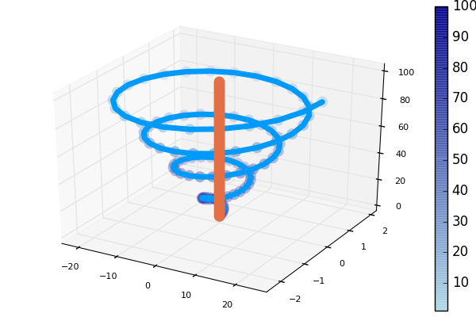

### Initialize

```julia
using Plots
pyplot()
```

### Lines

A simple line plot of the columns.

```julia
 # /Users/michael/.julia/v0.5/Plots/src/examples.jl, line 16:
plot(Plots.fakedata(50,5),w=3)
```


### Parametric plots

Plot function pair (x(u), y(u)).

```julia
 # /Users/michael/.julia/v0.5/Plots/src/examples.jl, line 35:
plot(sin,(x->begin  # /Users/michael/.julia/v0.5/Plots/src/examples.jl, line 35:
            sin(2x)
        end),0,2π,line=4,leg=false,fill=(0,:orange))
```


### Colors

Access predefined palettes (or build your own with the `colorscheme` method).  Line/marker colors are auto-generated from the plot's palette, unless overridden.  Set the `z` argument to turn on series gradients.

```julia
 # /Users/michael/.julia/v0.5/Plots/src/examples.jl, line 42:
y = rand(100)
 # /Users/michael/.julia/v0.5/Plots/src/examples.jl, line 43:
plot(0:10:100,rand(11,4),lab="lines",w=3,palette=:grays,fill=0,α=0.6)
 # /Users/michael/.julia/v0.5/Plots/src/examples.jl, line 44:
scatter!(y,zcolor=abs(y - 0.5),m=(:heat,0.8,stroke(1,:green)),ms=10 * abs(y - 0.5) + 4,lab="grad")
```


### Global

Change the guides/background/limits/ticks.  Convenience args `xaxis` and `yaxis` allow you to pass a tuple or value which will be mapped to the relevant args automatically.  The `xaxis` below will be replaced with `xlabel` and `xlims` args automatically during the preprocessing step. You can also use shorthand functions: `title!`, `xaxis!`, `yaxis!`, `xlabel!`, `ylabel!`, `xlims!`, `ylims!`, `xticks!`, `yticks!`

```julia
 # /Users/michael/.julia/v0.5/Plots/src/examples.jl, line 51:
y = rand(20,3)
 # /Users/michael/.julia/v0.5/Plots/src/examples.jl, line 52:
plot(y,xaxis=("XLABEL",(-5,30),0:2:20,:flip),background_color=RGB(0.2,0.2,0.2),leg=false)
 # /Users/michael/.julia/v0.5/Plots/src/examples.jl, line 53:
hline!(mean(y,1) + rand(1,3),line=(4,:dash,0.6,[:lightgreen :green :darkgreen]))
 # /Users/michael/.julia/v0.5/Plots/src/examples.jl, line 54:
vline!([5,10])
 # /Users/michael/.julia/v0.5/Plots/src/examples.jl, line 55:
title!("TITLE")
 # /Users/michael/.julia/v0.5/Plots/src/examples.jl, line 56:
yaxis!("YLABEL",:log10)
```


### Arguments

Plot multiple series with different numbers of points.  Mix arguments that apply to all series (marker/markersize) with arguments unique to each series (colors).  Special arguments `line`, `marker`, and `fill` will automatically figure out what arguments to set (for example, we are setting the `linestyle`, `linewidth`, and `color` arguments with `line`.)  Note that we pass a matrix of colors, and this applies the colors to each series.

```julia
 # /Users/michael/.julia/v0.5/Plots/src/examples.jl, line 78:
ys = Vector[rand(10),rand(20)]
 # /Users/michael/.julia/v0.5/Plots/src/examples.jl, line 79:
plot(ys,color=[:black :orange],line=(:dot,4),marker=([:hex :d],12,0.8,stroke(3,:gray)))
```


### Build plot in pieces

Start with a base plot...

```julia
 # /Users/michael/.julia/v0.5/Plots/src/examples.jl, line 86:
plot(rand(100) / 3,reg=true,fill=(0,:green))
```


### 

and add to it later.

```julia
 # /Users/michael/.julia/v0.5/Plots/src/examples.jl, line 93:
scatter!(rand(100),markersize=6,c=:orange)
```


### Histogram2D


```julia
 # /Users/michael/.julia/v0.5/Plots/src/examples.jl, line 100:
histogram2d(randn(10000),randn(10000),nbins=20)
```


### Line types


```julia
 # /Users/michael/.julia/v0.5/Plots/src/examples.jl, line 107:
linetypes = [:path :steppre :steppost :sticks :scatter]
 # /Users/michael/.julia/v0.5/Plots/src/examples.jl, line 108:
n = length(linetypes)
 # /Users/michael/.julia/v0.5/Plots/src/examples.jl, line 109:
x = Vector[sort(rand(20)) for i = 1:n]
 # /Users/michael/.julia/v0.5/Plots/src/examples.jl, line 110:
y = rand(20,n)
 # /Users/michael/.julia/v0.5/Plots/src/examples.jl, line 111:
plot(x,y,line=(linetypes,3),lab=map(string,linetypes),ms=15)
```


### Line styles


```julia
 # /Users/michael/.julia/v0.5/Plots/src/examples.jl, line 118:
styles = (filter((s->begin  # /Users/michael/.julia/v0.5/Plots/src/examples.jl, line 118:
            s in Plots.supported_styles()
        end),[:solid,:dash,:dot,:dashdot,:dashdotdot]))'
 # /Users/michael/.julia/v0.5/Plots/src/examples.jl, line 119:
n = length(styles)
 # /Users/michael/.julia/v0.5/Plots/src/examples.jl, line 120:
y = cumsum(randn(20,n),1)
 # /Users/michael/.julia/v0.5/Plots/src/examples.jl, line 121:
plot(y,line=(5,styles),label=map(string,styles))
```


### Marker types


```julia
 # /Users/michael/.julia/v0.5/Plots/src/examples.jl, line 128:
markers = (filter((m->begin  # /Users/michael/.julia/v0.5/Plots/src/examples.jl, line 128:
            m in Plots.supported_markers()
        end),Plots._shape_keys))'
 # /Users/michael/.julia/v0.5/Plots/src/examples.jl, line 129:
n = length(markers)
 # /Users/michael/.julia/v0.5/Plots/src/examples.jl, line 130:
x = (linspace(0,10,n + 2))[2:end - 1]
 # /Users/michael/.julia/v0.5/Plots/src/examples.jl, line 131:
y = repmat((reverse(x))',n,1)
 # /Users/michael/.julia/v0.5/Plots/src/examples.jl, line 132:
scatter(x,y,m=(8,:auto),lab=map(string,markers),bg=:linen,xlim=(0,10),ylim=(0,10))
```


### Bar

x is the midpoint of the bar. (todo: allow passing of edges instead of midpoints)

```julia
 # /Users/michael/.julia/v0.5/Plots/src/examples.jl, line 139:
bar(randn(99))
```


### Histogram


```julia
 # /Users/michael/.julia/v0.5/Plots/src/examples.jl, line 146:
histogram(randn(1000),nbins=20)
```


### Subplots

Use the `layout` keyword, and optionally the convenient `@layout` macro to generate arbitrarily complex subplot layouts.


```julia
 # /Users/michael/.julia/v0.5/Plots/src/examples.jl, line 155:
l = @layout([a{0.1h};b [c;d e]])
 # /Users/michael/.julia/v0.5/Plots/src/examples.jl, line 156:
plot(randn(100,5),layout=l,t=[:line :histogram :scatter :steppre :bar],leg=false,ticks=nothing,border=false)
```


### Adding to subplots

Note here the automatic grid layout, as well as the order in which new series are added to the plots.

```julia
 # /Users/michael/.julia/v0.5/Plots/src/examples.jl, line 163:
plot(Plots.fakedata(100,10),layout=4,palette=[:grays :blues :heat :lightrainbow],bg_inside=[:orange :pink :darkblue :black])
```


### 


```julia
 # /Users/michael/.julia/v0.5/Plots/src/examples.jl, line 170:
srand(111)
 # /Users/michael/.julia/v0.5/Plots/src/examples.jl, line 171:
plot!(Plots.fakedata(100,10))
```


### Open/High/Low/Close

Create an OHLC chart.  Pass in a list of (open,high,low,close) tuples as your `y` argument.  This uses recipes to first convert the tuples to OHLC objects, and subsequently create a :path series with the appropriate line segments.

```julia
 # /Users/michael/.julia/v0.5/Plots/src/examples.jl, line 178:
n = 20
 # /Users/michael/.julia/v0.5/Plots/src/examples.jl, line 179:
hgt = rand(n) + 1
 # /Users/michael/.julia/v0.5/Plots/src/examples.jl, line 180:
bot = randn(n)
 # /Users/michael/.julia/v0.5/Plots/src/examples.jl, line 181:
openpct = rand(n)
 # /Users/michael/.julia/v0.5/Plots/src/examples.jl, line 182:
closepct = rand(n)
 # /Users/michael/.julia/v0.5/Plots/src/examples.jl, line 183:
y = OHLC[(openpct[i] * hgt[i] + bot[i],bot[i] + hgt[i],bot[i],closepct[i] * hgt[i] + bot[i]) for i = 1:n]
 # /Users/michael/.julia/v0.5/Plots/src/examples.jl, line 184:
ohlc(y)
```


### Annotations

The `annotations` keyword is used for text annotations in data-coordinates.  Pass in a tuple (x,y,text) or a vector of annotations.  `annotate!(ann)` is shorthand for `plot!(; annotation=ann)`.  Series annotations are used for annotating individual data points.  They require only the annotation... x/y values are computed.  A `PlotText` object can be build with the method `text(string, attr...)`, which wraps font and color attributes.

```julia
 # /Users/michael/.julia/v0.5/Plots/src/examples.jl, line 191:
y = rand(10)
 # /Users/michael/.julia/v0.5/Plots/src/examples.jl, line 192:
plot(y,annotations=(3,y[3],text("this is #3",:left)),leg=false)
 # /Users/michael/.julia/v0.5/Plots/src/examples.jl, line 193:
annotate!([(5,y[5],text("this is #5",16,:red,:center)),(10,y[10],text("this is #10",:right,20,"courier"))])
 # /Users/michael/.julia/v0.5/Plots/src/examples.jl, line 194:
scatter!(linspace(2,8,6),rand(6),marker=(50,0.2,:orange),series_annotations=["series","annotations","map","to","series",text("data",:green)])
```


### Custom Markers

A `Plots.Shape` is a light wrapper around vertices of a polygon.  For supported backends, pass arbitrary polygons as the marker shapes.  Note: The center is (0,0) and the size is expected to be rougly the area of the unit circle.

```julia
 # /Users/michael/.julia/v0.5/Plots/src/examples.jl, line 201:
verts = [(-1.0,1.0),(-1.28,0.6),(-0.2,-1.4),(0.2,-1.4),(1.28,0.6),(1.0,1.0),(-1.0,1.0),(-0.2,-0.6),(0.0,-0.2),(-0.4,0.6),(1.28,0.6),(0.2,-1.4),(-0.2,-1.4),(0.6,0.2),(-0.2,0.2),(0.0,-0.2),(0.2,0.2),(-0.2,-0.6)]
 # /Users/michael/.julia/v0.5/Plots/src/examples.jl, line 204:
x = 0.1:0.2:0.9
 # /Users/michael/.julia/v0.5/Plots/src/examples.jl, line 205:
y = 0.7 * rand(5) + 0.15
 # /Users/michael/.julia/v0.5/Plots/src/examples.jl, line 206:
plot(x,y,line=(3,:dash,:lightblue),marker=(Shape(verts),30,RGBA(0,0,0,0.2)),bg=:pink,fg=:darkblue,xlim=(0,1),ylim=(0,1),leg=false)
```


### Contours

Any value for fill works here.  We first build a filled contour from a function, then an unfilled contour from a matrix.

```julia
 # /Users/michael/.julia/v0.5/Plots/src/examples.jl, line 214:
x = 1:0.5:20
 # /Users/michael/.julia/v0.5/Plots/src/examples.jl, line 215:
y = 1:0.5:10
 # /Users/michael/.julia/v0.5/Plots/src/examples.jl, line 216:
f(x,y) = begin  # /Users/michael/.julia/v0.5/Plots/src/examples.jl, line 216:
        (3x + y ^ 2) * abs(sin(x) + cos(y))
    end
 # /Users/michael/.julia/v0.5/Plots/src/examples.jl, line 217:
X = repmat(x',length(y),1)
 # /Users/michael/.julia/v0.5/Plots/src/examples.jl, line 218:
Y = repmat(y,1,length(x))
 # /Users/michael/.julia/v0.5/Plots/src/examples.jl, line 219:
Z = map(f,X,Y)
 # /Users/michael/.julia/v0.5/Plots/src/examples.jl, line 220:
p1 = contour(x,y,f,fill=true)
 # /Users/michael/.julia/v0.5/Plots/src/examples.jl, line 221:
p2 = contour(x,y,Z)
 # /Users/michael/.julia/v0.5/Plots/src/examples.jl, line 222:
plot(p1,p2)
```


### Pie


```julia
 # /Users/michael/.julia/v0.5/Plots/src/examples.jl, line 229:
x = ["Nerds","Hackers","Scientists"]
 # /Users/michael/.julia/v0.5/Plots/src/examples.jl, line 230:
y = [0.4,0.35,0.25]
 # /Users/michael/.julia/v0.5/Plots/src/examples.jl, line 231:
pie(x,y,title="The Julia Community",l=0.5)
```


### 3D


```julia
 # /Users/michael/.julia/v0.5/Plots/src/examples.jl, line 238:
n = 100
 # /Users/michael/.julia/v0.5/Plots/src/examples.jl, line 239:
ts = linspace(0,8π,n)
 # /Users/michael/.julia/v0.5/Plots/src/examples.jl, line 240:
x = ts .* map(cos,ts)
 # /Users/michael/.julia/v0.5/Plots/src/examples.jl, line 241:
y = (0.1ts) .* map(sin,ts)
 # /Users/michael/.julia/v0.5/Plots/src/examples.jl, line 242:
z = 1:n
 # /Users/michael/.julia/v0.5/Plots/src/examples.jl, line 243:
plot(x,y,z,zcolor=reverse(z),m=(10,0.8,:blues,stroke(0)),leg=false,cbar=true,w=5)
 # /Users/michael/.julia/v0.5/Plots/src/examples.jl, line 244:
plot!(zeros(n),zeros(n),1:n,w=10)
```



### Groups and Subplots


```julia
 # /Users/michael/.julia/v0.5/Plots/src/examples.jl, line 262:
group = rand(map((i->begin  # /Users/michael/.julia/v0.5/Plots/src/examples.jl, line 262:
                    "group $(i)"
                end),1:4),100)
 # /Users/michael/.julia/v0.5/Plots/src/examples.jl, line 263:
plot(rand(100),layout=@layout([a b;c]),group=group,linetype=[:bar :scatter :steppre])
```


### Polar Plots


```julia
 # /Users/michael/.julia/v0.5/Plots/src/examples.jl, line 270:
Θ = linspace(0,1.5π,100)
 # /Users/michael/.julia/v0.5/Plots/src/examples.jl, line 271:
r = abs(0.1 * randn(100) + sin(3Θ))
 # /Users/michael/.julia/v0.5/Plots/src/examples.jl, line 272:
plot(Θ,r,proj=:polar,m=2)
```


### Heatmap, categorical axes, and aspect_ratio


```julia
 # /Users/michael/.julia/v0.5/Plots/src/examples.jl, line 279:
xs = [string("x",i) for i = 1:10]
 # /Users/michael/.julia/v0.5/Plots/src/examples.jl, line 280:
ys = [string("y",i) for i = 1:4]
 # /Users/michael/.julia/v0.5/Plots/src/examples.jl, line 281:
z = float((1:4) * (1:10)')
 # /Users/michael/.julia/v0.5/Plots/src/examples.jl, line 282:
heatmap(xs,ys,z,aspect_ratio=1)
```


### Layouts, margins, label rotation, title location


```julia
 # /Users/michael/.julia/v0.5/Plots/src/examples.jl, line 289:
plot(rand(100,6),layout=@layout([a b;c]),title=["A" "B" "C"],title_location=:left,left_margin=[20mm 0mm],bottom_margin=50px,xrotation=60)
```


- Supported arguments: `annotations`, `arrow`, `aspect_ratio`, `background_color`, `background_color_inside`, `background_color_legend`, `background_color_outside`, `background_color_subplot`, `bar_edges`, `bar_position`, `bar_width`, `bins`, `bottom_margin`, `clims`, `color_palette`, `colorbar`, `colorbar_title`, `contours`, `discrete_values`, `dpi`, `fill_z`, `fillalpha`, `fillcolor`, `fillrange`, `flip`, `foreground_color`, `foreground_color_axis`, `foreground_color_border`, `foreground_color_grid`, `foreground_color_guide`, `foreground_color_legend`, `foreground_color_subplot`, `foreground_color_text`, `foreground_color_title`, `grid`, `group`, `guide`, `guidefont`, `html_output_format`, `inset_subplots`, `label`, `layout`, `left_margin`, `legend`, `legendfont`, `levels`, `lims`, `line_z`, `linealpha`, `linecolor`, `linestyle`, `linewidth`, `link`, `margin`, `marker_z`, `markeralpha`, `markercolor`, `markershape`, `markersize`, `markerstrokealpha`, `markerstrokecolor`, `markerstrokewidth`, `match_dimensions`, `normalize`, `orientation`, `overwrite_figure`, `polar`, `primary`, `projection`, `quiver`, `ribbon`, `right_margin`, `rotation`, `scale`, `series_annotations`, `seriesalpha`, `seriescolor`, `seriestype`, `show`, `size`, `smooth`, `subplot`, `subplot_index`, `tickfont`, `ticks`, `title`, `title_location`, `titlefont`, `top_margin`, `weights`, `window_title`, `x`, `xdiscrete_values`, `xerror`, `xflip`, `xforeground_color_axis`, `xforeground_color_border`, `xforeground_color_guide`, `xforeground_color_text`, `xguide`, `xguidefont`, `xlims`, `xlink`, `xrotation`, `xscale`, `xtickfont`, `xticks`, `y`, `ydiscrete_values`, `yerror`, `yflip`, `yforeground_color_axis`, `yforeground_color_border`, `yforeground_color_guide`, `yforeground_color_text`, `yguide`, `yguidefont`, `ylims`, `ylink`, `yrotation`, `yscale`, `ytickfont`, `yticks`, `z`, `zdiscrete_values`, `zflip`, `zforeground_color_axis`, `zforeground_color_border`, `zforeground_color_guide`, `zforeground_color_text`, `zguide`, `zguidefont`, `zlims`, `zlink`, `zrotation`, `zscale`, `ztickfont`, `zticks`
- Supported values for linetype: `:contour`, `:contour3d`, `:heatmap`, `:hexbin`, `:image`, `:path`, `:path3d`, `:pie`, `:scatter`, `:scatter3d`, `:shape`, `:steppost`, `:steppre`, `:surface`, `:wireframe`
- Supported values for linestyle: `:auto`, `:dash`, `:dashdot`, `:dot`, `:solid`
- Supported values for marker: `:+`, `:auto`, `:circle`, `:cross`, `:diamond`, `:dtriangle`, `:heptagon`, `:hexagon`, `:hline`, `:ltriangle`, `:none`, `:octagon`, `:pentagon`, `:pixel`, `:rect`, `:rtriangle`, `:star4`, `:star5`, `:star6`, `:star7`, `:star8`, `:utriangle`, `:vline`, `:x`, `:xcross`
(Automatically generated: 2017-05-31T13:24:25.183)