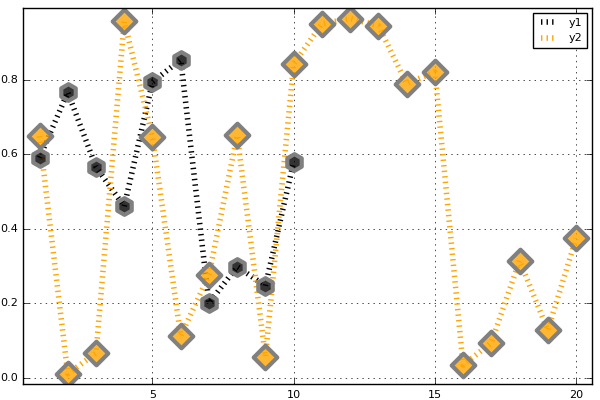
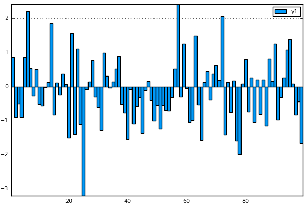
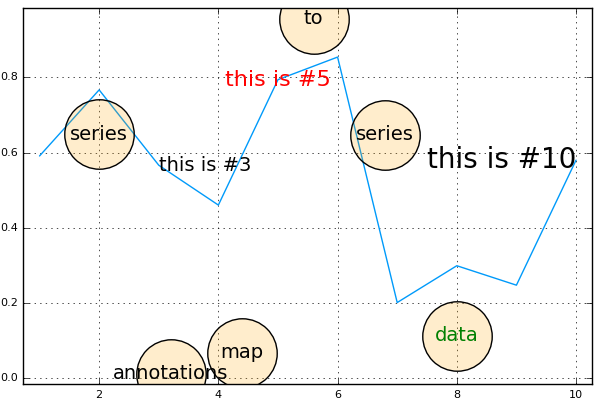

### Initialize

```julia
using Plots
pyplot()
```

### Lines

A simple line plot of the columns.

```julia
begin  # /home/tom/.julia/v0.4/Plots/src/examples.jl, line 29:
    plot(Plots.fakedata(50,5),w=3)
end
```


### Parametric plots

Plot function pair (x(u), y(u)).

```julia
begin  # /home/tom/.julia/v0.4/Plots/src/examples.jl, line 48:
    plot(sin,(x->begin  # /home/tom/.julia/v0.4/Plots/src/examples.jl, line 48:
                sin(2x)
            end),0,2π,line=4,leg=false,fill=(0,:orange))
end
```


### Colors

Access predefined palettes (or build your own with the `colorscheme` method).  Line/marker colors are auto-generated from the plot's palette, unless overridden.  Set the `z` argument to turn on series gradients.

```julia
begin  # /home/tom/.julia/v0.4/Plots/src/examples.jl, line 55:
    y = rand(100) # /home/tom/.julia/v0.4/Plots/src/examples.jl, line 56:
    plot(0:10:100,rand(11,4),lab="lines",w=3,palette=:grays,fill=(0,:auto),α=0.6) # /home/tom/.julia/v0.4/Plots/src/examples.jl, line 57:
    scatter!(y,zcolor=abs(y - 0.5),m=(:heat,0.8,stroke(1,:green)),ms=10 * abs(y - 0.5) + 4,lab="grad")
end
```


### Global

Change the guides/background/limits/ticks.  Convenience args `xaxis` and `yaxis` allow you to pass a tuple or value which will be mapped to the relevant args automatically.  The `xaxis` below will be replaced with `xlabel` and `xlims` args automatically during the preprocessing step. You can also use shorthand functions: `title!`, `xaxis!`, `yaxis!`, `xlabel!`, `ylabel!`, `xlims!`, `ylims!`, `xticks!`, `yticks!`

```julia
begin  # /home/tom/.julia/v0.4/Plots/src/examples.jl, line 64:
    y = rand(20,3) # /home/tom/.julia/v0.4/Plots/src/examples.jl, line 65:
    plot(y,xaxis=("XLABEL",(-5,30),0:2:20,:flip),background_color=RGB(0.2,0.2,0.2),leg=false) # /home/tom/.julia/v0.4/Plots/src/examples.jl, line 66:
    hline!(mean(y,1) + rand(1,3),line=(4,:dash,0.6,[:lightgreen :green :darkgreen])) # /home/tom/.julia/v0.4/Plots/src/examples.jl, line 67:
    vline!([5,10]) # /home/tom/.julia/v0.4/Plots/src/examples.jl, line 68:
    title!("TITLE") # /home/tom/.julia/v0.4/Plots/src/examples.jl, line 69:
    yaxis!("YLABEL",:log10)
end
```


### Images

Plot an image.  y-axis is set to flipped

```julia
begin  # /home/tom/.julia/v0.4/Plots/src/examples.jl, line 82:
    import Images # /home/tom/.julia/v0.4/Plots/src/examples.jl, line 83:
    img = Images.load(Pkg.dir("PlotReferenceImages","Plots","pyplot","0.7.0","ref1.png")) # /home/tom/.julia/v0.4/Plots/src/examples.jl, line 84:
    plot(img)
end
```


### Arguments

Plot multiple series with different numbers of points.  Mix arguments that apply to all series (marker/markersize) with arguments unique to each series (colors).  Special arguments `line`, `marker`, and `fill` will automatically figure out what arguments to set (for example, we are setting the `linestyle`, `linewidth`, and `color` arguments with `line`.)  Note that we pass a matrix of colors, and this applies the colors to each series.

```julia
begin  # /home/tom/.julia/v0.4/Plots/src/examples.jl, line 91:
    ys = Vector[rand(10),rand(20)] # /home/tom/.julia/v0.4/Plots/src/examples.jl, line 92:
    plot(ys,color=[:black :orange],line=(:dot,4),marker=([:hex :d],12,0.8,stroke(3,:gray)))
end
```



### Build plot in pieces

Start with a base plot...

```julia
begin  # /home/tom/.julia/v0.4/Plots/src/examples.jl, line 99:
    plot(rand(100) / 3,reg=true,fill=(0,:green))
end
```


### 

and add to it later.

```julia
begin  # /home/tom/.julia/v0.4/Plots/src/examples.jl, line 106:
    scatter!(rand(100),markersize=6,c=:orange)
end
```


### Histogram2D


```julia
begin  # /home/tom/.julia/v0.4/Plots/src/examples.jl, line 113:
    histogram2d(randn(10000),randn(10000),nbins=20)
end
```


### Line types


```julia
begin  # /home/tom/.julia/v0.4/Plots/src/examples.jl, line 120:
    linetypes = [:path :steppre :steppost :sticks :scatter] # /home/tom/.julia/v0.4/Plots/src/examples.jl, line 121:
    n = length(linetypes) # /home/tom/.julia/v0.4/Plots/src/examples.jl, line 122:
    x = Vector[sort(rand(20)) for i = 1:n] # /home/tom/.julia/v0.4/Plots/src/examples.jl, line 123:
    y = rand(20,n) # /home/tom/.julia/v0.4/Plots/src/examples.jl, line 124:
    plot(x,y,line=(linetypes,3),lab=map(string,linetypes),ms=15)
end
```


### Line styles


```julia
begin  # /home/tom/.julia/v0.4/Plots/src/examples.jl, line 131:
    styles = setdiff(supportedStyles(),[:auto])' # /home/tom/.julia/v0.4/Plots/src/examples.jl, line 132:
    plot(cumsum(randn(20,length(styles)),1),style=:auto,label=map(string,styles),w=5)
end
```


### Marker types


```julia
begin  # /home/tom/.julia/v0.4/Plots/src/examples.jl, line 139:
    markers = setdiff(supportedMarkers(),[:none,:auto,Shape])' # /home/tom/.julia/v0.4/Plots/src/examples.jl, line 140:
    n = length(markers) # /home/tom/.julia/v0.4/Plots/src/examples.jl, line 141:
    x = (linspace(0,10,n + 2))[2:end - 1] # /home/tom/.julia/v0.4/Plots/src/examples.jl, line 142:
    y = repmat(reverse(x)',n,1) # /home/tom/.julia/v0.4/Plots/src/examples.jl, line 143:
    scatter(x,y,m=(8,:auto),lab=map(string,markers),bg=:linen,xlim=(0,10),ylim=(0,10))
end
```


### Bar

x is the midpoint of the bar. (todo: allow passing of edges instead of midpoints)

```julia
begin  # /home/tom/.julia/v0.4/Plots/src/examples.jl, line 150:
    bar(randn(99))
end
```



### Histogram


```julia
begin  # /home/tom/.julia/v0.4/Plots/src/examples.jl, line 157:
    histogram(randn(1000),nbins=20)
end
```


### Subplots

subplot and subplot! are distinct commands which create many plots and add series to them in a circular fashion.
You can define the layout with keyword params... either set the number of plots `n` (and optionally number of rows `nr` or
number of columns `nc`), or you can set the layout directly with `layout`.


```julia
begin  # /home/tom/.julia/v0.4/Plots/src/examples.jl, line 168:
    plot(randn(100,5),layout=@layout([a,b,grid(1,3)]),t=[:line :histogram :scatter :steppre :bar],nbins=10,leg=false)
end
```


### Adding to subplots

Note here the automatic grid layout, as well as the order in which new series are added to the plots.

```julia
begin  # /home/tom/.julia/v0.4/Plots/src/examples.jl, line 175:
    plot(Plots.fakedata(100,10),layout=4,palette=[:grays :blues :heat :lightrainbow],bg_inside=[:orange :pink :darkblue :black])
end
```


### 


```julia
begin  # /home/tom/.julia/v0.4/Plots/src/examples.jl, line 182:
    srand(111) # /home/tom/.julia/v0.4/Plots/src/examples.jl, line 183:
    plot!(Plots.fakedata(100,10))
end
```


### Open/High/Low/Close

Create an OHLC chart.  Pass in a list of (open,high,low,close) tuples as your `y` argument.  This uses recipes to first convert the tuples to OHLC objects, and subsequently create a :path series with the appropriate line segments.

```julia
begin  # /home/tom/.julia/v0.4/Plots/src/examples.jl, line 190:
    n = 20 # /home/tom/.julia/v0.4/Plots/src/examples.jl, line 191:
    hgt = rand(n) + 1 # /home/tom/.julia/v0.4/Plots/src/examples.jl, line 192:
    bot = randn(n) # /home/tom/.julia/v0.4/Plots/src/examples.jl, line 193:
    openpct = rand(n) # /home/tom/.julia/v0.4/Plots/src/examples.jl, line 194:
    closepct = rand(n) # /home/tom/.julia/v0.4/Plots/src/examples.jl, line 195:
    y = OHLC[(openpct[i] * hgt[i] + bot[i],bot[i] + hgt[i],bot[i],closepct[i] * hgt[i] + bot[i]) for i = 1:n] # /home/tom/.julia/v0.4/Plots/src/examples.jl, line 196:
    ohlc(y)
end
```


### Annotations

The `annotations` keyword is used for text annotations in data-coordinates.  Pass in a tuple (x,y,text) or a vector of annotations.  `annotate!(ann)` is shorthand for `plot!(; annotation=ann)`.  Series annotations are used for annotating individual data points.  They require only the annotation... x/y values are computed.  A `PlotText` object can be build with the method `text(string, attr...)`, which wraps font and color attributes.

```julia
begin  # /home/tom/.julia/v0.4/Plots/src/examples.jl, line 203:
    y = rand(10) # /home/tom/.julia/v0.4/Plots/src/examples.jl, line 204:
    plot(y,annotations=(3,y[3],text("this is #3",:left)),leg=false) # /home/tom/.julia/v0.4/Plots/src/examples.jl, line 205:
    annotate!([(5,y[5],text("this is #5",16,:red,:center)),(10,y[10],text("this is #10",:right,20,"courier"))]) # /home/tom/.julia/v0.4/Plots/src/examples.jl, line 206:
    scatter!(linspace(2,8,6),rand(6),marker=(50,0.2,:orange),series_annotations=["series","annotations","map","to","series",text("data",:green)])
end
```



### Custom Markers

A `Plots.Shape` is a light wrapper around vertices of a polygon.  For supported backends, pass arbitrary polygons as the marker shapes.  Note: The center is (0,0) and the size is expected to be rougly the area of the unit circle.

```julia
begin  # /home/tom/.julia/v0.4/Plots/src/examples.jl, line 213:
    verts = [(-1.0,1.0),(-1.28,0.6),(-0.2,-1.4),(0.2,-1.4),(1.28,0.6),(1.0,1.0),(-1.0,1.0),(-0.2,-0.6),(0.0,-0.2),(-0.4,0.6),(1.28,0.6),(0.2,-1.4),(-0.2,-1.4),(0.6,0.2),(-0.2,0.2),(0.0,-0.2),(0.2,0.2),(-0.2,-0.6)] # /home/tom/.julia/v0.4/Plots/src/examples.jl, line 216:
    x = 0.1:0.2:0.9 # /home/tom/.julia/v0.4/Plots/src/examples.jl, line 217:
    y = 0.7 * rand(5) + 0.15 # /home/tom/.julia/v0.4/Plots/src/examples.jl, line 218:
    plot(x,y,line=(3,:dash,:lightblue),marker=(Shape(verts),30,RGBA(0,0,0,0.2)),bg=:pink,fg=:darkblue,xlim=(0,1),ylim=(0,1),leg=false)
end
```


### Contours

Any value for fill works here.  We first build a filled contour from a function, then an unfilled contour from a matrix.

```julia
begin  # /home/tom/.julia/v0.4/Plots/src/examples.jl, line 226:
    x = 1:0.5:20 # /home/tom/.julia/v0.4/Plots/src/examples.jl, line 227:
    y = 1:0.5:10 # /home/tom/.julia/v0.4/Plots/src/examples.jl, line 228:
    f(x,y) = begin  # /home/tom/.julia/v0.4/Plots/src/examples.jl, line 228:
            (3x + y ^ 2) * abs(sin(x) + cos(y))
        end # /home/tom/.julia/v0.4/Plots/src/examples.jl, line 229:
    X = repmat(x',length(y),1) # /home/tom/.julia/v0.4/Plots/src/examples.jl, line 230:
    Y = repmat(y,1,length(x)) # /home/tom/.julia/v0.4/Plots/src/examples.jl, line 231:
    Z = map(f,X,Y) # /home/tom/.julia/v0.4/Plots/src/examples.jl, line 232:
    p1 = contour(x,y,f,fill=true) # /home/tom/.julia/v0.4/Plots/src/examples.jl, line 233:
    p2 = contour(x,y,Z) # /home/tom/.julia/v0.4/Plots/src/examples.jl, line 234:
    plot(p1,p2)
end
```


### Pie


```julia
begin  # /home/tom/.julia/v0.4/Plots/src/examples.jl, line 247:
    x = ["Nerds","Hackers","Scientists"] # /home/tom/.julia/v0.4/Plots/src/examples.jl, line 248:
    y = [0.4,0.35,0.25] # /home/tom/.julia/v0.4/Plots/src/examples.jl, line 249:
    pie(x,y,title="The Julia Community",l=0.5)
end
```


### 3D


```julia
begin  # /home/tom/.julia/v0.4/Plots/src/examples.jl, line 256:
    n = 100 # /home/tom/.julia/v0.4/Plots/src/examples.jl, line 257:
    ts = linspace(0,8π,n) # /home/tom/.julia/v0.4/Plots/src/examples.jl, line 258:
    x = ts .* map(cos,ts) # /home/tom/.julia/v0.4/Plots/src/examples.jl, line 259:
    y = (0.1ts) .* map(sin,ts) # /home/tom/.julia/v0.4/Plots/src/examples.jl, line 260:
    z = 1:n # /home/tom/.julia/v0.4/Plots/src/examples.jl, line 261:
    plot(x,y,z,zcolor=reverse(z),m=(10,0.8,:blues,stroke(0)),leg=false,cbar=true,w=5) # /home/tom/.julia/v0.4/Plots/src/examples.jl, line 262:
    plot!(zeros(n),zeros(n),1:n,w=10)
end
```


### DataFrames

Plot using DataFrame column symbols.

```julia
begin  # /home/tom/.julia/v0.4/Plots/src/examples.jl, line 269:
    import RDatasets # /home/tom/.julia/v0.4/Plots/src/examples.jl, line 270:
    iris = RDatasets.dataset("datasets","iris") # /home/tom/.julia/v0.4/Plots/src/examples.jl, line 271:
    scatter(iris,:SepalLength,:SepalWidth,group=:Species,title="My awesome plot",xlabel="Length",ylabel="Width",marker=(0.5,[:+ :h :star7],12),bg=RGB(0.2,0.2,0.2))
end
```


### Groups and Subplots


```julia
begin  # /home/tom/.julia/v0.4/Plots/src/examples.jl, line 280:
    group = rand(map((i->begin  # /home/tom/.julia/v0.4/Plots/src/examples.jl, line 280:
                        "group $(i)"
                    end),1:4),100) # /home/tom/.julia/v0.4/Plots/src/examples.jl, line 281:
    plot(rand(100),layout=@layout([a b;c]),group=group,n=3,linetype=[:bar :scatter :steppre])
end
```


### Polar Plots


```julia
begin  # /home/tom/.julia/v0.4/Plots/src/examples.jl, line 288:
    Θ = linspace(0,1.5π,100) # /home/tom/.julia/v0.4/Plots/src/examples.jl, line 289:
    r = abs(0.1 * randn(100) + sin(3Θ)) # /home/tom/.julia/v0.4/Plots/src/examples.jl, line 290:
    plot(Θ,r,proj=:polar,m=2)
end
```


### Heatmap, categorical axes, and aspect_ratio


```julia
begin  # /home/tom/.julia/v0.4/Plots/src/examples.jl, line 297:
    xs = [string("x",i) for i = 1:10] # /home/tom/.julia/v0.4/Plots/src/examples.jl, line 298:
    ys = [string("y",i) for i = 1:4] # /home/tom/.julia/v0.4/Plots/src/examples.jl, line 299:
    z = float((1:4) * 1:10') # /home/tom/.julia/v0.4/Plots/src/examples.jl, line 300:
    heatmap(xs,ys,z,aspect_ratio=1)
end
```


### Layouts, margins, label rotation, title location


```julia
begin  # /home/tom/.julia/v0.4/Plots/src/examples.jl, line 307:
    plot(rand(100,6),layout=@layout([a b;c]),title=["A" "B" "C"],title_location=:left,left_margin=[20mm 0mm],bottom_margin=50px,xrotation=60)
end
```


### Boxplot and Violin series recipes


```julia
begin  # /home/tom/.julia/v0.4/Plots/src/examples.jl, line 316:
    import RDatasets # /home/tom/.julia/v0.4/Plots/src/examples.jl, line 317:
    singers = RDatasets.dataset("lattice","singer") # /home/tom/.julia/v0.4/Plots/src/examples.jl, line 318:
    violin(singers,:VoicePart,:Height,marker=(0.2,:blue,stroke(0))) # /home/tom/.julia/v0.4/Plots/src/examples.jl, line 319:
    boxplot!(singers,:VoicePart,:Height,marker=(0.3,:orange,stroke(2)))
end
```


- Supported arguments: `annotations`, `arrow`, `aspect_ratio`, `background_color`, `background_color_inside`, `background_color_legend`, `background_color_outside`, `bar_edges`, `bar_width`, `bins`, `color_palette`, `colorbar`, `contours`, `fillalpha`, `fillcolor`, `fillrange`, `foreground_color`, `foreground_color_axis`, `foreground_color_border`, `foreground_color_grid`, `foreground_color_legend`, `foreground_color_text`, `grid`, `group`, `guidefont`, `label`, `layout`, `legend`, `legendfont`, `levels`, `linealpha`, `linecolor`, `linestyle`, `linewidth`, `marker_z`, `markeralpha`, `markercolor`, `markershape`, `markersize`, `markerstrokealpha`, `markerstrokecolor`, `markerstrokewidth`, `match_dimensions`, `n`, `nc`, `normalize`, `nr`, `orientation`, `overwrite_figure`, `polar`, `quiver`, `ribbon`, `seriesalpha`, `seriescolor`, `seriestype`, `show`, `size`, `smooth`, `subplot`, `tickfont`, `title`, `weights`, `window_title`, `x`, `xerror`, `xflip`, `xguide`, `xlims`, `xrotation`, `xscale`, `xticks`, `y`, `yerror`, `yflip`, `yguide`, `ylims`, `yrotation`, `yscale`, `yticks`, `z`, `z`, `zflip`, `zguide`, `zlims`, `zrotation`, `zscale`, `zticks`
- Supported values for axis: `:auto`, `:left`, `:right`
- Supported values for linetype: `:bar`, `:contour`, `:contour3d`, `:heatmap`, `:hexbin`, `:histogram`, `:histogram2d`, `:hline`, `:image`, `:line`, `:none`, `:path`, `:path3d`, `:pie`, `:scatter`, `:scatter3d`, `:shape`, `:steppost`, `:steppre`, `:sticks`, `:surface`, `:vline`, `:wireframe`
- Supported values for linestyle: `:auto`, `:dash`, `:dashdot`, `:dot`, `:solid`
- Supported values for marker: `:Plots.Shape`, `:auto`, `:cross`, `:diamond`, `:dtriangle`, `:ellipse`, `:heptagon`, `:hexagon`, `:hline`, `:none`, `:octagon`, `:pentagon`, `:rect`, `:star4`, `:star5`, `:star6`, `:star7`, `:star8`, `:utriangle`, `:vline`, `:xcross`
- Is `subplot`/`subplot!` supported? Yes

(Automatically generated: 2016-06-08T15:57:42)