## Examples for backend: unicodeplots

### Initialize

```julia
using Plots
unicodeplots()
```

### Lines

A simple line plot of the columns.

```julia
plot(fakedata(50,5),w=3)
```

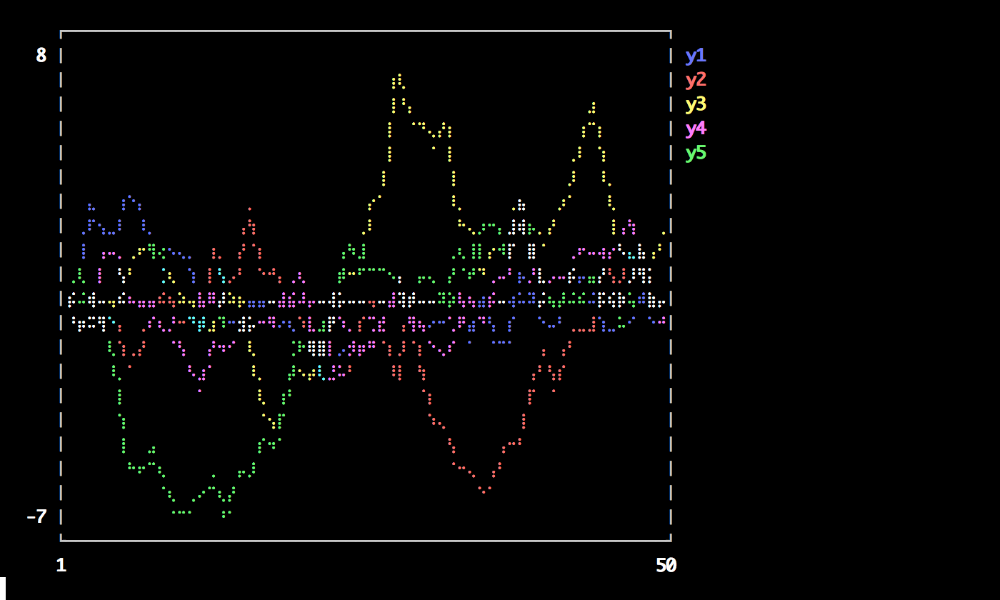

### Parametric plots

Plot function pair (x(u), y(u)).

```julia
plot(sin,(x->begin  # /Users/tom/.julia/v0.4/Plots/docs/example_generation.jl, line 50:
            sin(2x)
        end),0,2π,line=4,leg=false,fill=(0,:orange))
```

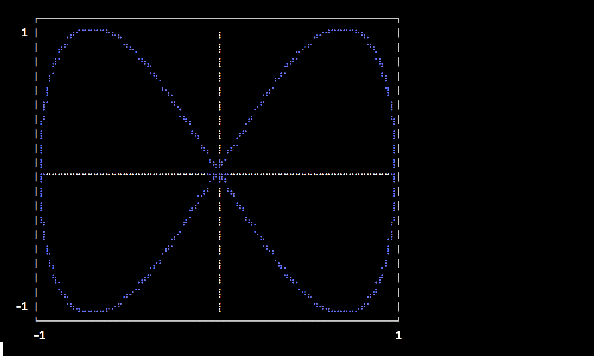

### Colors

Access predefined palettes (or build your own with the `colorscheme` method).  Line/marker colors are auto-generated from the plot's palette, unless overridden.  Set the `z` argument to turn on series gradients.

```julia
y = rand(100)
plot(0:10:100,rand(11,4),lab="lines",w=3,palette=:grays,fill=(0.5,:auto))
scatter!(y,z=abs(y - 0.5),m=(10,:heat),lab="grad")
```

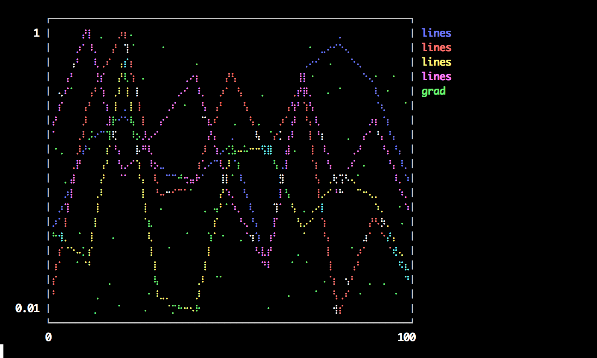

### Global

Change the guides/background/limits/ticks.  Convenience args `xaxis` and `yaxis` allow you to pass a tuple or value which will be mapped to the relevant args automatically.  The `xaxis` below will be replaced with `xlabel` and `xlims` args automatically during the preprocessing step. You can also use shorthand functions: `title!`, `xaxis!`, `yaxis!`, `xlabel!`, `ylabel!`, `xlims!`, `ylims!`, `xticks!`, `yticks!`

```julia
plot(rand(20,3),xaxis=("XLABEL",(-5,30),0:2:20,:flip),background_color=RGB(0.2,0.2,0.2),leg=false)
title!("TITLE")
yaxis!("YLABEL",:log10)
```

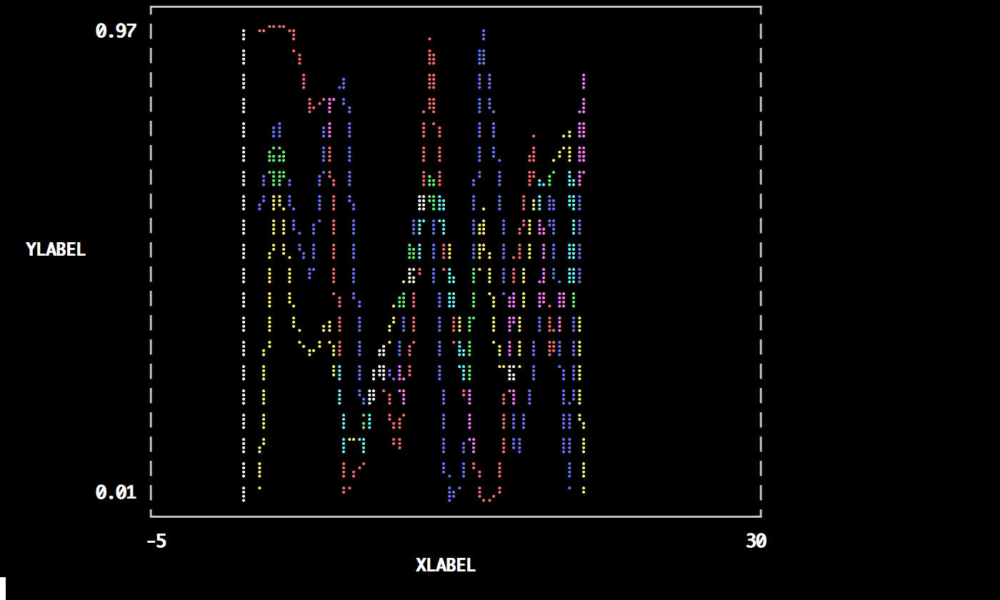

### Two-axis

Use the `axis` arguments.

Note: Currently only supported with Qwt and PyPlot

```julia
plot(Vector[randn(100),randn(100) * 100],axis=[:l :r],ylabel="LEFT",yrightlabel="RIGHT")
```

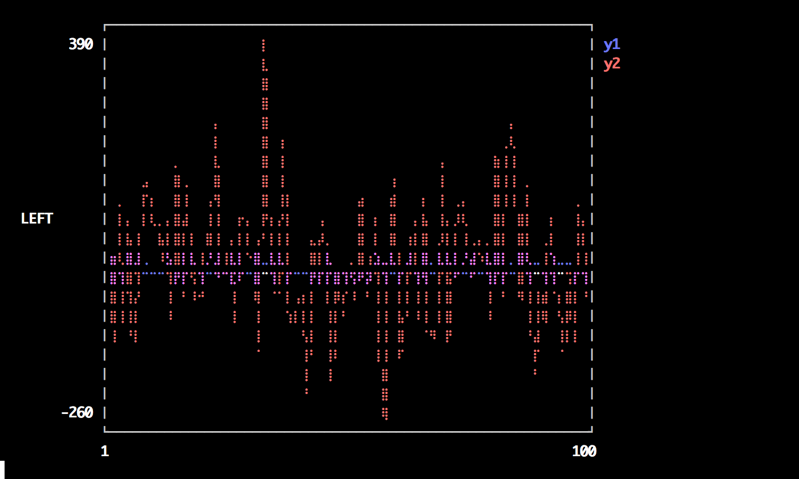

### Arguments

Plot multiple series with different numbers of points.  Mix arguments that apply to all series (marker/markersize) with arguments unique to each series (colors).  Special arguments `line`, `marker`, and `fill` will automatically figure out what arguments to set (for example, we are setting the `linestyle`, `linewidth`, and `color` arguments with `line`.)  Note that we pass a matrix of colors, and this applies the colors to each series.

```julia
plot(Vector[rand(10),rand(20)],marker=(:circle,8),line=(:dot,3,[:black :orange]))
```

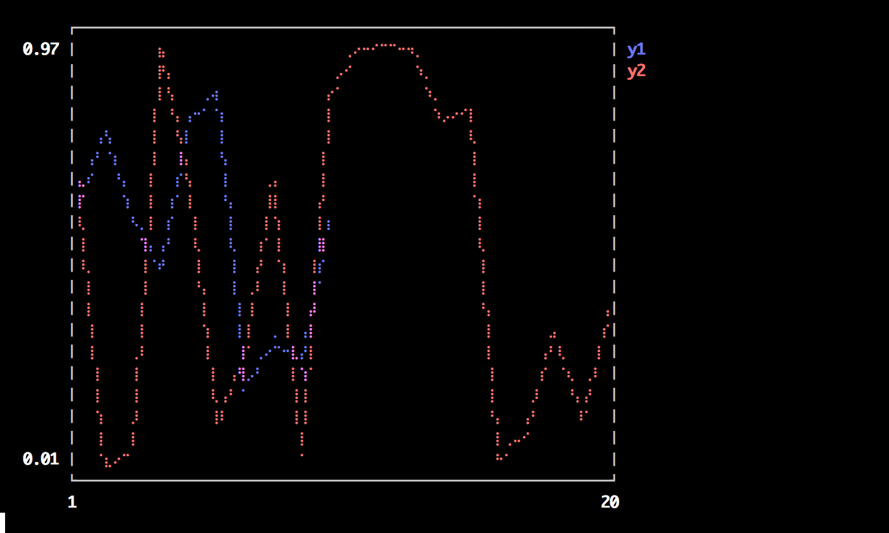

### Build plot in pieces

Start with a base plot...

```julia
plot(rand(100) / 3,reg=true,fill=(0,:green))
```

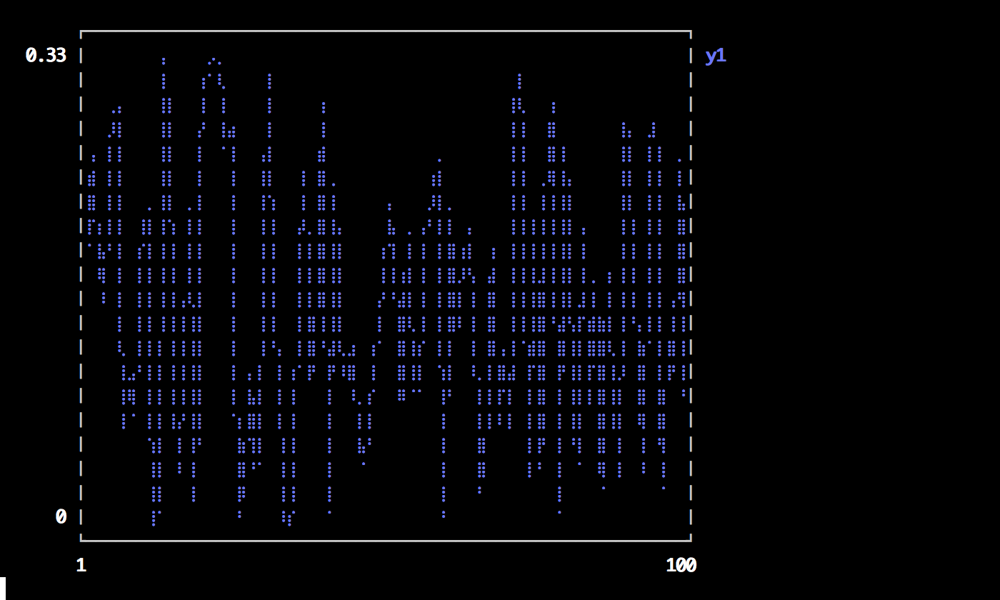

### 

and add to it later.

```julia
scatter!(rand(100),markersize=6,c=:orange)
```

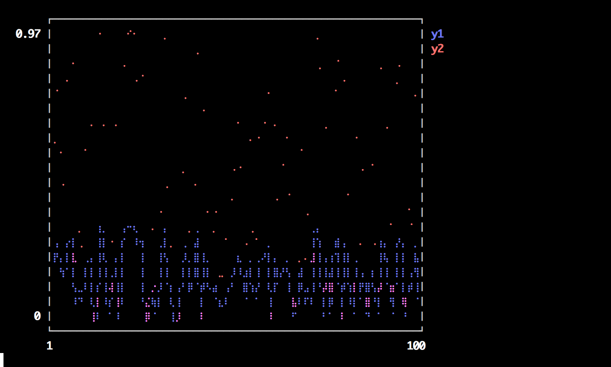

### Line types


```julia
types = intersect(supported_types(),[:line,:path,:steppre,:steppost,:sticks,:scatter])'
n = length(types)
x = Vector[sort(rand(20)) for i = 1:n]
y = rand(20,n)
plot(x,y,line=(types,3),lab=map(string,types),ms=15)
```

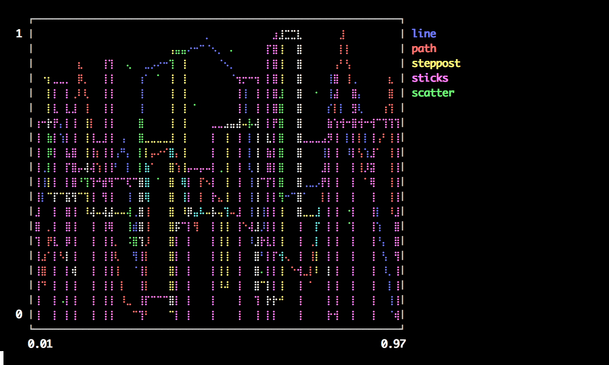

### Line styles


```julia
styles = setdiff(supported_styles(),[:auto])'
plot(cumsum(randn(20,length(styles)),1),style=:auto,label=map(string,styles),w=5)
```

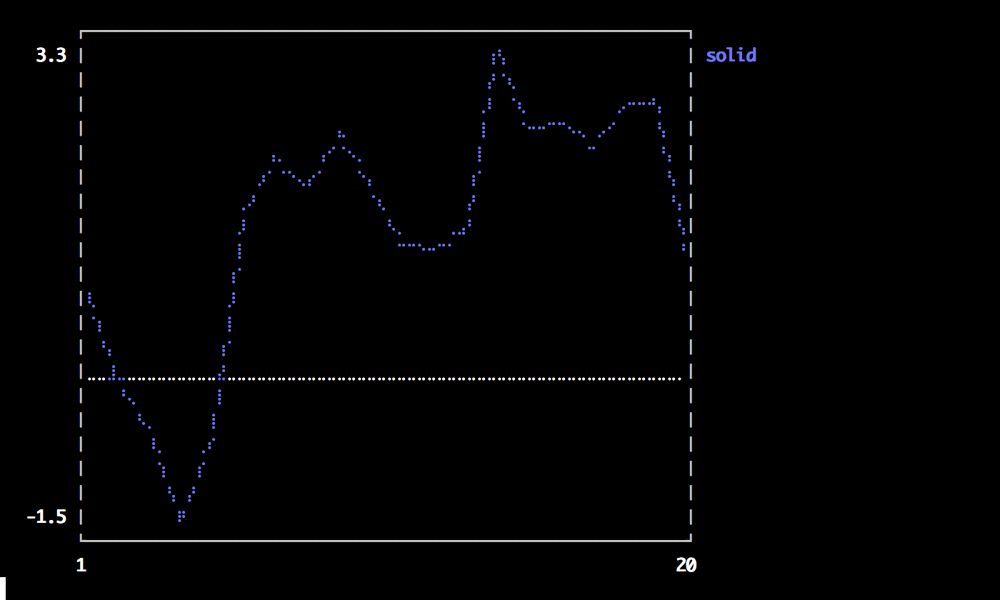

### Marker types


```julia
markers = setdiff(supported_markers(),[:none,:auto,Shape])'
n = length(markers)
x = (linspace(0,10,n + 2))[2:end - 1]
y = repmat(reverse(x)',n,1)
scatter(x,y,m=(8,:auto),lab=map(string,markers),bg=:linen)
```

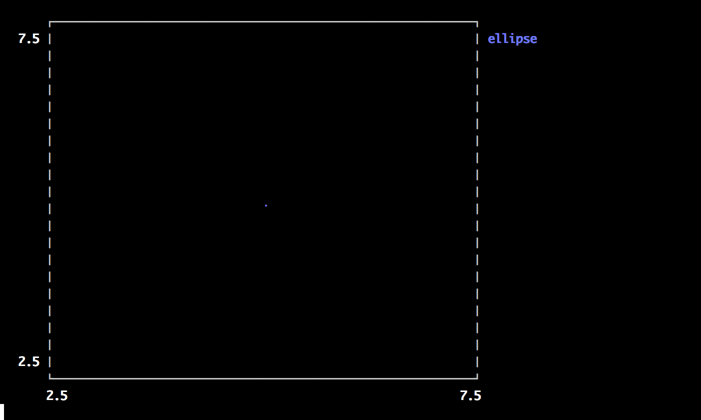

### Bar

x is the midpoint of the bar. (todo: allow passing of edges instead of midpoints)

```julia
bar(randn(999))
```

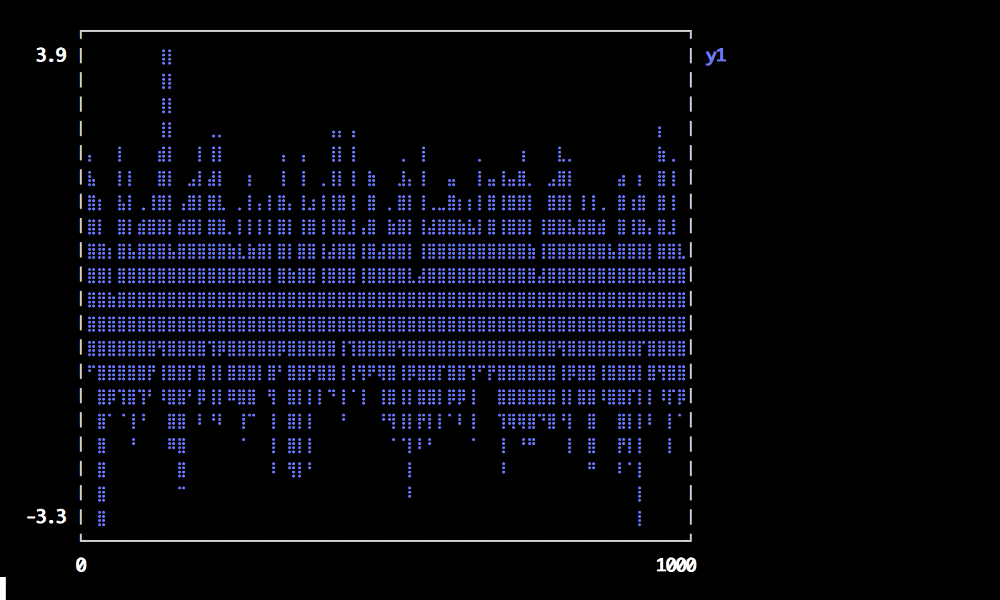

### Histogram


```julia
histogram(randn(1000),nbins=50)
```

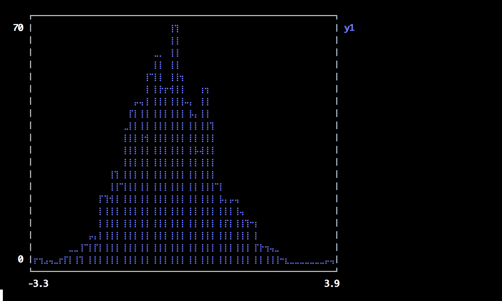

### Subplots

  subplot and subplot! are distinct commands which create many plots and add series to them in a circular fashion.
  You can define the layout with keyword params... either set the number of plots `n` (and optionally number of rows `nr` or 
  number of columns `nc`), or you can set the layout directly with `layout`.


```julia
subplot(randn(100,5),layout=[1,1,3],t=[:line :hist :scatter :step :bar],nbins=10,leg=false)
```

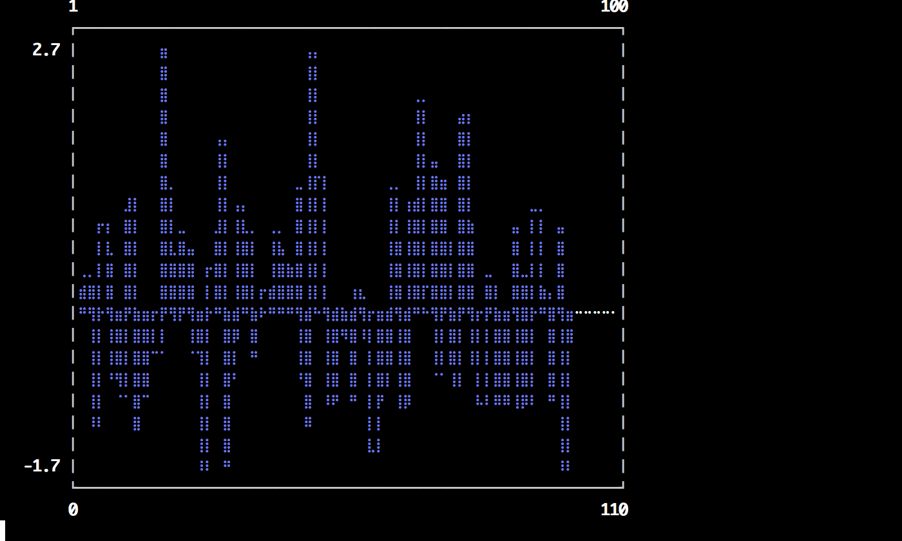

### Adding to subplots

Note here the automatic grid layout, as well as the order in which new series are added to the plots.

```julia
subplot(fakedata(100,10),n=4,palette=[:grays :blues :heat :lightrainbow],bg=[:orange :pink :darkblue :black])
```

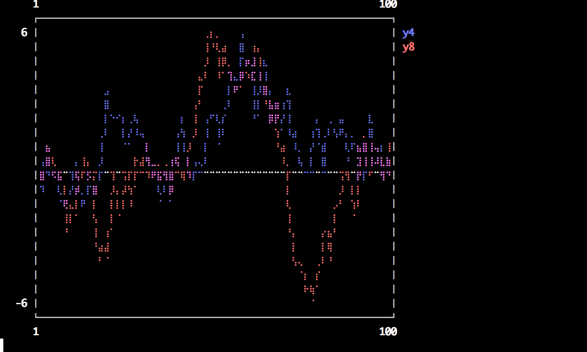

### 


```julia
subplot!(fakedata(100,10))
```

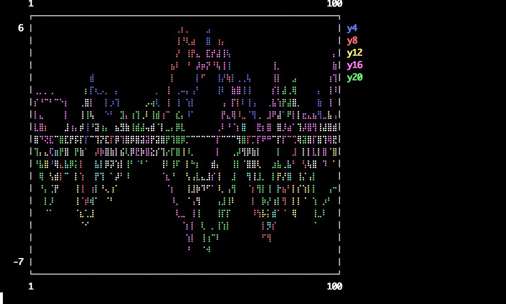

### Custom Markers

A `Plots.Shape` is a light wrapper around vertices of a polygon.  For supported backends, pass arbitrary polygons as the marker shapes.  Note: The center is (0,0) and the size is expected to be rougly the area of the unit circle.

```julia
verts = [(-1.0,1.0),(-1.28,0.6),(-0.2,-1.4),(0.2,-1.4),(1.28,0.6),(1.0,1.0),(-1.0,1.0),(-0.2,-0.6),(0.0,-0.2),(-0.4,0.6),(1.28,0.6),(0.2,-1.4),(-0.2,-1.4),(0.6,0.2),(-0.2,0.2),(0.0,-0.2),(0.2,0.2),(-0.2,-0.6)]
plot(0.1:0.2:0.9,0.7 * rand(5) + 0.15,l=(3,:dash,:lightblue),m=(Shape(verts),30,RGBA(0,0,0,0.2)),bg=:pink,fg=:darkblue,xlim=(0,1),ylim=(0,1),leg=false)
```

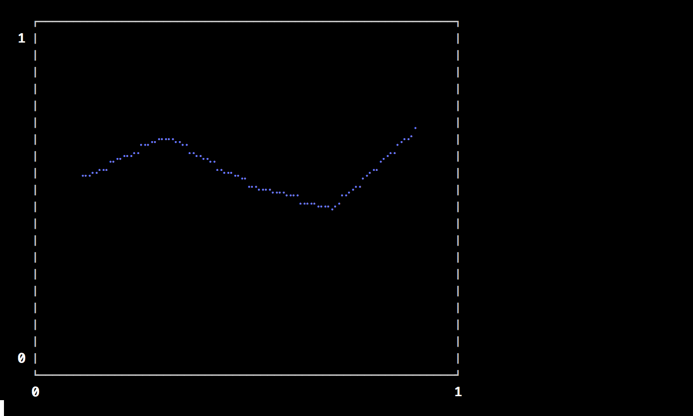

- Supported arguments: `group`, `label`, `legend`, `linestyle`, `linetype`, `markershape`, `nbins`, `show`, `size`, `title`, `windowtitle`, `x`, `xlabel`, `xlims`, `y`, `ylabel`, `ylims`
- Supported values for axis: `:auto`, `:left`
- Supported values for linetype: `:bar`, `:heatmap`, `:hexbin`, `:hist`, `:hline`, `:line`, `:none`, `:path`, `:scatter`, `:steppost`, `:sticks`, `:vline`
- Supported values for linestyle: `:auto`, `:solid`
- Supported values for marker: `:auto`, `:circle`, `:none`
- Is `subplot`/`subplot!` supported? Yes

(Automatically generated: 2015-10-18T00:07:46)