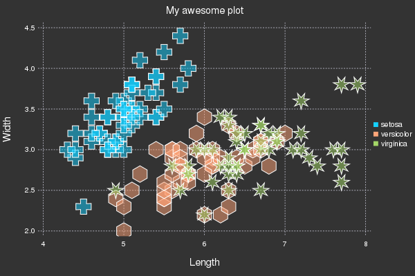

# Intro to Plots in Julia

**Author: Thomas Breloff (@tbreloff)**

Data visualization has a complicated history, with plotting software making trade-offs between features vs simplicity, speed vs beauty, and static vs dynamic.  Some make a visualization and never change it, others must make updates in real-time.

Plots is a visualization interface and toolset.  It sits above other visualization "backends", connecting commands with implementation.  If one backend does not support your desired features, or make the right trade-offs, just switch to another backend with one command.  No need to change your code.  No need to learn something new.  Plots might be the last plotting package you ever learn.

My goals with the package are:

- **Powerful**.  Do more with less.  Complex visualizations become easy.
- **Intuitive**.  Start generating plots without reading volumes of documentation.  Commands should "just work".
- **Concise**.  Less code means fewer mistakes and more efficient development/analysis.
- **Flexible**.  Produce your favorite plots from your favorite package, but quicker and simpler.
- **Consistent**.  Don't commit to one graphics package.  Use the same code and access the strengths of all [backends](/backends).
- **Lightweight**.  Very few dependencies, since backends are loaded and initialized dynamically.
- **Smart**.  It's not quite AGI, but Plots should figure out what you **want** it to do... not just what you **tell** it.

Use the [preprocessing pipeline](/pipeline) in Plots to fully describe your visualization before it calls the backend code.  This maintains modularity and allows for efficient separation of front end code, algorithms, and backend graphics.  New graphical backends can be added with minimal effort.

Please add wishlist items, bugs, or any other comments/questions to the [issues list](https://github.com/tbreloff/Plots.jl/issues).

---

### Simple is Beautiful

Lorenz Attractor

```julia
# initialize the attractor
n = 1500
dt = 0.02
σ, ρ, β = 10., 28., 8/3
x, y, z = 1., 1., 1.

# initialize a 3D plot with 1 empty series
plt = path3d(1, xlim=(-25,25), ylim=(-25,25), zlim=(0,50),
                xlab = "x", ylab = "y", zlab = "z",
                title = "Lorenz Attractor", marker = 1)

# build an animated gif, saving every 10th frame
@gif for i=1:n
    dx = σ*(y - x)     ; x += dt * dx
    dy = x*(ρ - z) - y ; y += dt * dy
    dz = x*y - β*z     ; z += dt * dz
    push!(plt, x, y, z)
end every 10
```


Make some waves

```julia
using Plots
pyplot(reuse=true)

@gif for i in linspace(0,2π,100)
    X = Y = linspace(-5,5,40)
    surface(X, Y, (x,y) -> sin(x+10sin(i))+cos(y))
end
```


Iris Dataset

```julia
# load a dataset
using RDatasets
iris = dataset("datasets", "iris");

# Scatter plot with some custom settings
scatter(iris, :SepalLength, :SepalWidth, group=:Species,
        title = "My awesome plot",
        xlabel = "Length", ylabel = "Width",
        m=(0.5, [:+ :h :star7], 12),
        bg=RGB(.2,.2,.2))

# save a png
png("iris")
```



---

[TOC]
