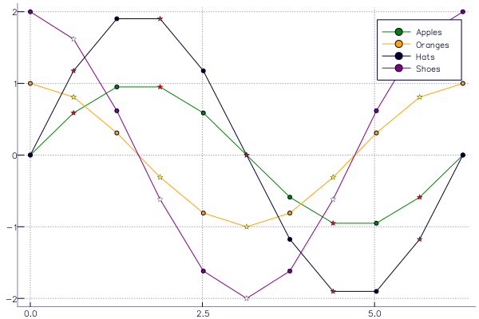
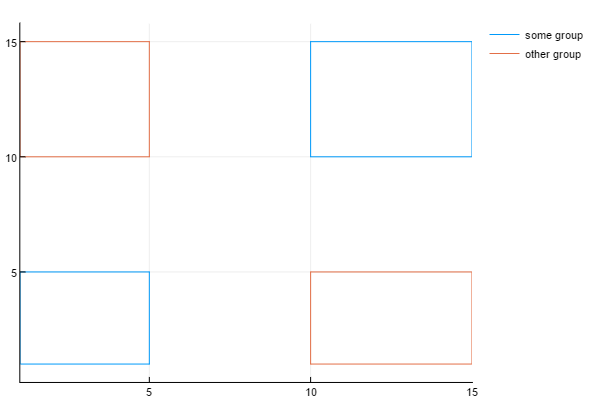
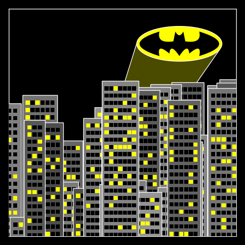

# Input Data

Part of the power of Plots lies is in the many combinations of allowed input data.
You shouldn't spend your time transforming and massaging your data into a specific format.
Let Plots do that for you.

There are a few rules to remember, and you'll be a power user in no time.

## Inputs are arguments, not keywords

While `plot(x = 1:10, y = rand(10))` will work as expected, it is not the preferred method.  In fact,
this method will simply call `plot(1:10, rand(10))`.  Instead,
use `plot(rand(10))`.  In this case, a single input will be mapped to the `:y` keyword, and a missing
value for `:x` will impute a unit range `1:10`.

The reason lies in the flexibility of Julia's multiple dispatch, where every combination of input types
can have unique behavior, when desired.

## Columns are series

In most cases, passing a (`n` × `m`) matrix of values (numbers, etc) will create `m` series, each with `n` data points.  This follows a consistent rule… vectors apply to a series, matrices apply to many series.  This rule carries into keyword arguments.  `scatter(rand(10,4), markershape = [:circle, :rect])` will create 4 series, each assigned the markershape vector [:circle,:rect].  However, `scatter(rand(10,4), markershape = [:circle :rect])` will create 4 series, with series 1 and 3 having markers shaped as `:circle` and series 2 and 4 having markers shaped as `:rect` (i.e. as squares).  The difference is that in the first example, it is a length-2 column vector, and in the second example it is a (1 × 2) row vector (a Matrix).

The flexibility and power of this can be illustrated by the following piece of code:
```julia
using Plots; gr()

# 10 data points in 4 series
xs = 0 : 2π/10 : 2π
data = [sin.(xs) cos.(xs) 2sin.(xs) 2cos.(xs)]

# We put labels in a row vector: applies to each series
labels = ["Apples" "Oranges" "Hats" "Shoes"]

# Marker shapes in a column vector: applies to data points
markershapes = [:circle, :star5]

# Marker colors in a matrix: applies to series and data points
markercolors = [:green :orange :black :purple
                :red   :yellow :brown :white]

plot(xs, data, label = labels, shape = markershapes, color = markercolors,
     markersize = 10)
```
This example plots the four series with different labels, marker shapes, and marker colors by combining row and column vectors to decorate the data.  The result is:


## Unconnected Data within same groups

As shown in the examples, you can plot a single polygon by using a single call to `plot` usingi the `:path` line type. You can use several calls to `plot` to draw several polygons

Now, let's say you're plotting `n` polygons grouped into `g` groups, with `n` < `g`. While you can use `plot` to draw separate polygons with each call, you cannot group two separate plots back into a single group. You'll end up with `n` groups in the legend, rather than `g` groups.

To adress this, you can use `NaN` as a path separator. A call to `plot` would then draw one path with disjoints The following code draws `n=4` rectangles in `g=2` groups.

```julia
using Plots; plotly()

function rectangle_from_coords(xb,yb,xt,yt)
	[
		xb yb
		xt yb
		xt yt
		xb yt
		xb yb
		NaN NaN
	]
end

some_rects=[
	rectangle_from_coords(1 ,1 ,5 ,5 )
	rectangle_from_coords(10,10,15,15)
	]
other_rects=[
	rectangle_from_coords(1 ,10,5 ,15)
	rectangle_from_coords(10,1 ,15,5 )
	]

plot(some_rects[:,1], some_rects[:,2],label="some group")
plot!(other_rects[:,1], other_rects[:,2],label="other group")
```
This examples produces the following:


## DataFrames support

Using the [StatPlots](https://github.com/JuliaPlots/StatPlots.jl) extension package, you can pass a `DataFrame` as the first argument (similar to Gadfly or R's ggplot2).  For data fields or certain attributes (such as `group`) a symbol will be replaced with the corresponding column(s) of the `DataFrame`.  Additionally, the column name might be used as the   An example:

```julia
using StatPlots, RDatasets
iris = dataset("datasets", "iris")
scatter(iris, :SepalLength, :SepalWidth, group=:Species,
        m=(0.5, [:+ :h :star7], 12), bg=RGB(.2,.2,.2))
```


## Functions

Functions can typically be used in place of input data, and they will be mapped as needed. 2D and 3D parametric plots can also be created, and ranges can be given as vectors or min/max.  For example, here are alternative methods to create the same plot:

```julia
using Plots
tmin = 0
tmax = 4π
tvec = linspace(tmin, tmax, 100)

plot(sin(tvec), cos(tvec))
plot(sin, cos, tvec)
plot(sin, cos, tmin, tmax)
```

Vectors of functions are allowed as well (one series per function).

## Images

Images can be directly added to plots by using the [Images.jl](https://github.com/timholy/Images.jl) library. For example, one can import a raster image and plot it with Plots via the commands:

```julia
using Plots,Images
img = load("image.png")
plot(img)
```

PDF graphics can also be added to Plots.jl plots using `load("image.pdf")`. Note that Images.jl requires that the PDF color scheme is RGB.

## Shapes

Check out [this tutorial](https://github.com/tbreloff/ExamplePlots.jl/blob/master/notebooks/batman.ipynb) to save Gotham:


