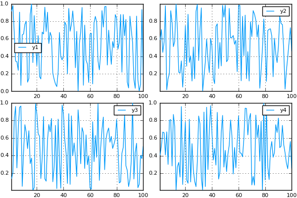
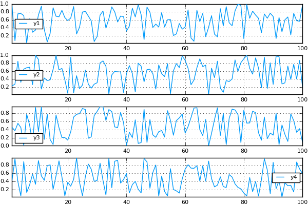
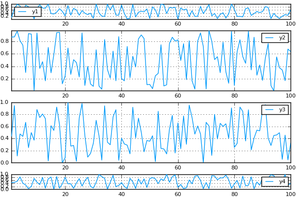
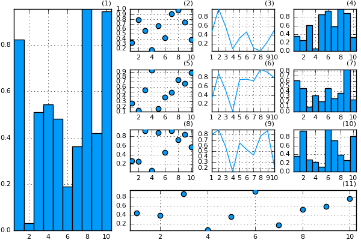

# Layouts

As of v0.7.0, Plots has taken control of subplot positioning, allowing complex, nested grids of subplots and components.  Care has been taken to keep the framework flexible and generic, so that backends need only support the ability to precisely define the absolute position of a subplot, and they get the full power of nesting, plot area alignment, and more.  Just set the `layout` keyword in a call to `plot(...)`

It's helpful at this point to review terminology:

- **Plot**: The whole figure/window
- **Subplot**: One subplot, containing a title, axes, colorbar, legend, and plot area.
- **Axis**: One axis of a subplot, containing axis guide (label), tick labels, and tick marks.
- **Plot Area**: The part of a subplot where the data is shown... contains the series, grid lines, etc.
- **Series**: One distinct visualization of data. (For example: a line or a set of markers)

---

#### Simple Layouts

Pass an integer to `layout` to allow it to automatically compute a grid size for that many subplots:

```julia
# create a 2x2 grid, and map each of the 4 series to one of the subplots
plot(rand(100,4), layout = 4)
```



Pass a tuple to `layout` to create a grid of that size:

```julia
# create a 4x1 grid, and map each of the 4 series to one of the subplots
plot(rand(100,4), layout = (4,1))
```




More complex grid layouts can be created with the `grid(...)` constructor:

```julia
plot(rand(100,4), layout = grid(4,1,heights=[0.1,0.4,0.4,0.1]))
```



---

#### Advanced Layouts

The `@layout` macro is the easiest way to define complex layouts, using Julia's [multidimensional Array construction](http://docs.julialang.org/en/release-0.4/manual/arrays/#concatenation) as the basis for a custom layout syntax.  Precise sizing can be acheived with curly brackets, otherwise the free space is equally split between the **plot areas** of subplots.


```julia
l = @layout [  a{0.3w} [grid(3,3)
			             b{0.2h} ]]
plot(
	rand(10,11),
	layout = l, legend = false, seriestype = [:bar :scatter :path],
	title = ["($i)" for i=1:11]', titleloc = :right, titlefont = font(8)
)
```



---

Create inset (floating) subplots using the `inset_subplots` attribute. `inset_subplots` takes a list of (parent_layout, BoundingBox) tuples, where the bounding box is relative to the parent.

Use `px`/`mm`/`inch` for absolute coords, `w`/`h` for percentage relative to the parent. Origin is top-left. `h_anchor`/`v_anchor` define what the `x`/`y` inputs of the bounding box refer to.

```julia
using Plots
plot(heatmap(randn(10,20)), boxplot(rand(1:4,1000),randn(1000)), leg=false)
histogram!(randn(1000), inset_subplots = [(1, bbox(0.05w,0.95h,0.5w,0.5h, v_anchor=:bottom))], subplot=3, ticks=nothing)
sticks!(randn(100), inset_subplots=[bbox(0.35w,0.5h,200px,200px,h_anchor=:center,v_anchor=:center)], subplot=4)
```


