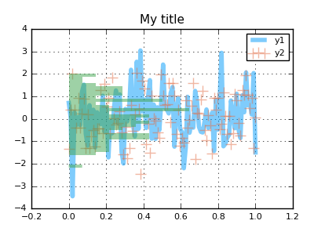
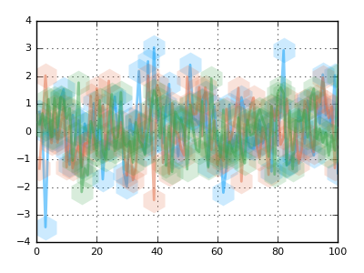
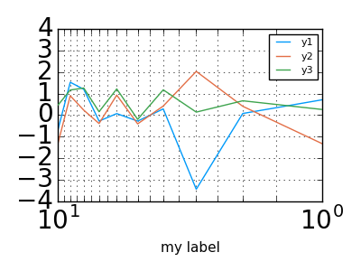
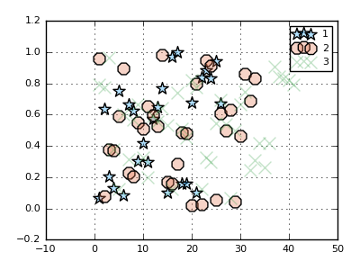

# Processing Pipeline

Plotting commands will send inputs through a series of preprocessing steps, in order to convert, simplify, and generalize.
The idea is that end-users need incredible flexibility in what (and how) they are able to make calls.  They may want total control over
plot attributes, or none at all.  There may be 8 attributes that are constant, but one that varies by data series.  We need to be able to
easily layer complex plots on top of each other, and easily define what they should look like.  Input data might come in any form.

I'll go through the steps that occur after a call to `plot()`, and show the power and flexibility that arises.

The examples can be found in [this notebook](https://github.com/tbreloff/ExamplePlots.jl/blob/master/notebooks/pipeline.ipynb).

### An example command

Suppose we have data:

```julia
n = 100
x, y = linspace(0,1,n), randn(n, 3)
```

and we'd like to visualize `x` against each column of `y`.  Here's a sample command in Plots:

```julia
using Plots; pyplot()
plot(x, y, line = (0.5, [4 1 0], [:path :scatter :density]),
    marker=(10, 0.5, [:none :+ :none]), fill=0.5,
    orientation = :h, title = "My title")
```



In this example, we have an input matrix, and we'd like to plot three series on top of each other, one for each column of data.
We create a row vector (1x3 matrix) of symbols to assign different visualization types for each series, set the orientation of the histogram, and set
alpha values.

For comparison's sake, this is somewhat similar to the following calls in PyPlot:

```julia
import PyPlot
fig = PyPlot.gcf()
fig[:set_size_inches](4,3,forward=true)
fig[:set_dpi](100)
PyPlot.clf()

PyPlot.plot(x, y[:,1], alpha = 0.5, "steelblue", linewidth = 4)
PyPlot.scatter(x, y[:,2], alpha = 0.5, marker = "+", s = 100, c="orangered")
PyPlot.plt[:hist](y[:,3], orientation = "horizontal", alpha = 0.5,
                          normed = true, bins=30, color="green",
                          linewidth = 0)

ax = PyPlot.gca()
ax[:xaxis][:grid](true)
ax[:yaxis][:grid](true)
PyPlot.title("My title")
PyPlot.legend(["y1","y2"])
PyPlot.show()
```

### Step 1: Replace aliases

In Plots, there are many aliased names for keyword arguments.  The reason is primarily to avoid the necessity of constantly looking up the API during plot building.
Generally speaking, many of the common names that you might expect to see are all supported.  I find that, personally, I've spent tons of time through my career referencing the documentation of
matplotlib and others, only because I couldn't remember the argument names.  Thanks to aliases, we can replace `line`, `marker`, and `fill` with aliases `l`, `m`, and `f` for compact commands.

The following commands are equivalent:

```julia
plot(y, lab = "my label", l = (2,0.5), m = (:hex,20,0.2,stroke(0)), key = false)

plot(y, label = "my label", line = (2,0.5), marker = (:hexagon,20,0.2,stroke(0)), legend = false)
```



### Step 2: Handle "Magic Arguments"

Some arguments encompass smart shorthands for setting many related arguments at the same time.  For example, passing a tuple of settings to the `xaxis` argument will allow the quick definition
of `xlabel`, `xlim`, `xticks`, `xscale`, `xflip`, and `tickfont`.  Plots uses type checking and multiple dispatch to smartly "figure out" which values apply to which argument.  These are equivalent:

```julia
plot(y, xaxis = ("my label", (0,10), 0:0.5:10, :log, :flip, font(20, "Courier")))

plot(y, xlabel = "my label", xlim = (0,10), xticks = 0:0.5:10,
        xscale = :log, xflip = true, tickfont = font(20, "Courier"))
```



Afterwards, there are some arguments which are simplified and compressed, such as converting the boolean setting `colorbar = false` to the internal description `colorbar = :none` as to allow
complex behavior without complex interface.


### Step 3: `_apply_recipe` callbacks

Users can add custom definitions of `_apply_recipe(d::KW, ...; ...)`, which is expected to return a tuple of the arguments for the converted plotting command.  Examples are best:

```julia
type MyVecWrapper
  v::Vector{Float64}
end
mv = MyVecWrapper(rand(100))

@recipe mv::MyVecWrapper begin
    :shape => :circle
    :ms => 30
    (mv.v, )
end

subplot(
    plot(mv.v),
    plot(mv)
)
```


This hook gave us a nice way to swap out the input data and add custom visualization attributes for a user type.

### Step 4:  Apply groupings

When you'd like to split a data series into multiple plot series, you can use the `group` keyword.  Attributes can be applied to the resulting
series as if your data had been already separated into distinct input data.  The `group` variable determines how to split the data and also assigns the legend label.

In this example, we split the data points into 3 groups randomly, and give them different marker shapes (`[:s :o :x]` are aliases for `:star5`, `:octagon`, and `:xcross`).
The other attibutes (`:markersize` and `:markeralpha`) are shared.

```julia
scatter(rand(100), group = rand(1:3, 100), marker = (10,0.3,[:s :o :x]))
```



### Step 5:  Process Input Data

Plots will rarely ask you to pre-process your own inputs.  You have a Julia array? Great.  DataFrame? No problem.  Surface function? You got it.

During this step, Plots will translate your input data (within the context of the plot type and other inputs) into a list of sliced and/or expanded representations,
where each item represents the data for one plot series.  Under the hood, it makes heavy use of [multiple dispatch](http://docs.julialang.org/en/release-0.4/manual/methods/)
in the internal methods `process_inputs`, `convertToAnyVector`,  and `compute_xyz`.

```julia
# Any AbstractMatrix will create 4 series... 1 for each column.
# As there is only one input, it is assigned to the y-axis,
#  and x values are imputed as the range 1:size(y,1).
plot(rand(100,4))

# If the first argument is a DataFrame, subsequent symbols are mapped to columns of that DataFrame.
plot(dataframe, :column_name_x, :column_name_y)

# Functions are mapped to vectors, or between endpoints, or even to the current axis ranges.

# y = map(f, x)
plot(x, sin)

# can reverse
plot(sin, x)

# plot between values (range is imputed)
plot(sin, xmin, xmax)

# plot using the current x-limits
plot!(sin)

# plot lists of functions
plot([sin, cos], xmin, xmax)
```

There is also support for strings, dates, surfaces, and more.  And you can always `wrap(input_object)` if
you want to pass something through directly to the backend.  (Perhaps the backend supports something that Plots does not)

### Step 6: Build the series arguments

At this point, it's time to process the multitude of positional and keyword arguments which will define the visualization for each data series.
We track the index number of this series relative to the command, the plot, and any wrapping subplot.  This allows us to fine-tune which sub-arguments
apply to this series, and possibly pick an intelligent default value.  For example, line colors are chosen to be distinguishable from both the background and other lines, default labels are assigned, shapes are chosen, and aliases applied where valid.  Finally, warnings will be issued if a plotting feature is not supported by the backend.

### Step 7:  Series recipes

Certain visualizations are composed of existing building blocks, contrary to many other plotting libraries.  Rather than start from scratch for a new
visualization, you can incorporate plot components in a modular way.  Box-plots, violin plots, errorbars, ribbons, and quiver plots are all examples
of visualizations that are built as series recipes as opposed to standalone visualizations.  The generalized approach allows us to do complex recipes
in backends that wouldn't otherwise support the functionality.

Some examples:

- [boxplot/violin](https://github.com/tbreloff/ExamplePlots.jl/blob/master/notebooks/boxplot.ipynb)
- [errorbar/ribbon](https://github.com/tbreloff/ExamplePlots.jl/blob/master/notebooks/errorbars.ipynb)
- [quiver](https://github.com/tbreloff/ExamplePlots.jl/blob/master/notebooks/quiver.ipynb)

### Step 8: Add annotations

Annotations are written over the plot using plot-coordinates.

```julia
y = rand(10)
plot(y,ann=(3,y[3],text("this is #3",:left)))
annotate!([(5,y[5],text("this is #5",16,:red,:center)),(10,y[10],text("this is #10",:right,20,"courier"))])
```


### Step 9: Update global Plot attributes

Set the title, axis labels/limits/ticks/scale/flip, background and foreground colors, legends, colorbars, window size, and more.

### Step 10: Display it

Finally we make this plot "current", and optionally display it.  Pass `show=true` to override the default display behavior (to bring up a gui window while
in IJulia, for example).  A semicolon in the REPL or IJulia will suppress display.
