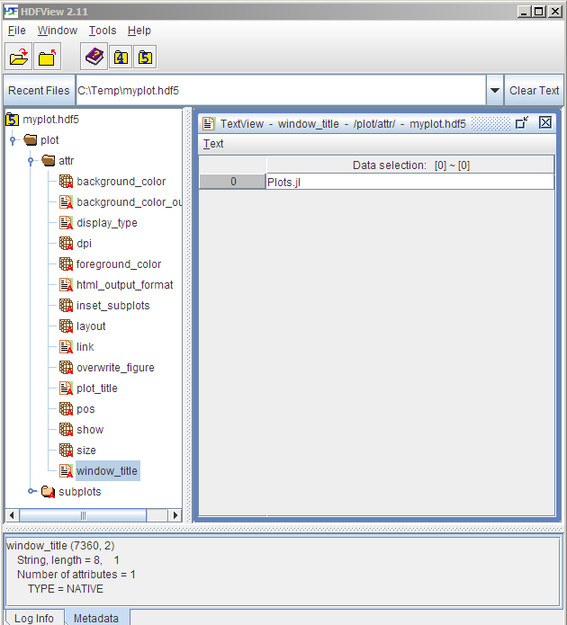

```@setup backends
using StatsPlots, RecipesBase, Statistics; gr()
Plots.reset_defaults()

@userplot BackendPlot

@recipe function f(bp::BackendPlot; n = 4)
    t = range(0, 3π, length = 100)
    d = rand(3, 3)

    layout := n

    @series begin
        subplot := 1
        f = s -> -cos(s) * log(s)
        g = t -> sin(t) * log(t)
        [f g]
    end

    @series begin
        subplot := 2 + (n > 2)
        RecipesBase.recipetype(:groupedbar, d)
    end

    if n > 2
        @series begin
            subplot := 2
            line_z := t
            label := false
            seriescolor := :viridis
            seriestype := surface
            t, t, (x, y) -> x * sin(x) - y * cos(y)
        end

        @series begin
            subplot := 4
            seriestype := contourf
            t, t, (x, y) -> x * sin(x) - y * cos(y)
        end
    end
end
```

# [Backends](@id backends)

Backends are the lifeblood of Plots, and the diversity between features, approaches, and strengths/weaknesses was
one of the primary reasons that I started this package.

For those who haven't had the pleasure of hacking on 15 different plotting APIs:  First, consider yourself lucky.  However,
you will probably have a hard time choosing the right backend for your task at hand.  This document is meant to be a guide and
introduction to making that choice.

# At a glance

My favorites: GR for speed, Plotly(JS) for interactivity, PyPlot otherwise.

If you require... | ... then use...
----------- | -----------------
features         | PyPlot, Plotly(JS), GR
speed            | GR, InspectDR
interactivity    | Plotly(JS), PyPlot, InspectDR
beauty           | Plotly(JS), PGFPlots/ PGFPlotsX
REPL Plotting    | UnicodePlots
3D plots         | PyPlot, GR, Plotly(JS)
a GUI Window     | GR, PyPlot, PlotlyJS, InspectDR
a small footprint | UnicodePlots, Plotly
plot+data -> `.hdf5` file | HDF5

Of course nothing in life is that simple.  Likely there are subtle tradeoffs between backends, long hidden bugs, and more excitement.  Don't be shy to try out something new!

---

## [GR](https://github.com/jheinen/GR.jl)

Super fast with lots of plot types. Still actively developed and improving daily.

```@example backends
gr(); backendplot() # hide
```

Pros:

- Speed
- 2D and 3D
- Standalone or inline

Cons:

- Limited interactivity

Primary author: Josef Heinen (@jheinen)

## [Plotly / PlotlyJS](https://github.com/spencerlyon2/PlotlyJS.jl)

These are treated as separate backends, though they share much of the code and use the Plotly javascript API.  `plotly()` is the only dependency-free plotting option,
as the required javascript is bundled with Plots.  It can create inline plots in IJulia, or open standalone browser windows when run from the Julia REPL.

`plotlyjs()` is the preferred option, and taps into the great functionality of Spencer Lyon's PlotlyJS.jl.  Inline IJulia plots can be updated from any cell... something that
makes this backend stand out.  From the Julia REPL, it taps into Blink.jl and Electron to plot within a standalone GUI window... also very cool. Also, PlotlyJS supports saving the output to more formats than Plotly, such as EPS and PDF, and thus is the recommended version of Plotly for developing publication-quality figures.

```@example backends
plotly(); backendplot(n = 2) # hide # hide
png("backends_plotly") # hide
```


Pros:

- [Tons of functionality](https://plot.ly/javascript/)
- 2D and 3D
- Mature library
- Interactivity (even when inline)
- Standalone or inline

Cons:

- No custom shapes
- JSON may limit performance

Primary PlotlyJS.jl author: Spencer Lyon (@spencerlyon2)

### Mathjax

Plotly needs to load mathjax to render LaTeX strings, therefore passing extra keywords with `extra_kwargs = :plot` is implemented.
With that it is possible to pass a header to the extra `include_mathjax` keyword.
It has the following options:

- `include_mathjax = ""` (default): no mathjax header
- `include_mathjax = "cdn"` include the standard online version of the header
- `include_mathjax = "<filename?config=xyz>"` include a user-defined file

These can also be passed using the `extra_plot_kwargs` keyword.

```@example backends
using LaTeXStrings
plotly()
plot(1:4, [[1,4,9,16]*10000, [0.5, 2, 4.5, 8]],
           labels = [L"\alpha_{1c} = 352 \pm 11 \text{ km s}^{-1}";
                     L"\beta_{1c} = 25 \pm 11 \text{ km s}^{-1}"] |> permutedims,
           xlabel = L"\sqrt{(n_\text{c}(t|{T_\text{early}}))}",
           ylabel = L"d, r \text{ (solar radius)}",
           yformatter = :plain,
           extra_plot_kwargs = KW(
               :include_mathjax => "cdn", 
               :yaxis => KW(:automargin => true),
               :xaxis => KW(:domain => "auto")
               ),
       )
Plots.html("plotly_mathjax") # hide
```
```@raw html
<object type="text/html" data="plotly_mathjax.html" style="width:100%;height:450px;"></object>
```

## [PyPlot](https://github.com/stevengj/PyPlot.jl)

A Julia wrapper around the popular python package PyPlot (Matplotlib).  It uses PyCall.jl to pass data with minimal overhead.

```@example backends
pyplot(); backendplot() # hide
```

Pros:

- Tons of functionality
- 2D and 3D
- Mature library
- Standalone or inline
- Well supported in Plots

Cons:

- Uses python
- Dependencies frequently cause setup issues

Primary author: Steven G Johnson (@stevengj)

## [PGFPlotsX](https://github.com/KristofferC/PGFPlotsX.jl)

LaTeX plotting, based on PGF/TikZ.

```@example backends
pgfplotsx(); backendplot() # hide
png("pgfx_backends") # hide
```


Successor backend of PGFPlots-backend.

Has more features and is still in development otherwise the same.

!!! tip
    To add save a standalone .tex file including a preamble use attribute `tex_output_standalone = true` in your `plot` command.

Pros:

- Nice looking plots
- Lots of functionality (though the code is still WIP)

Cons:

- Tricky to install
- Heavy-weight dependencies

Authors:

- PGFPlots: Christian Feuersanger
- PGFPlotsX.jl: Kristoffer Carlsson (@KristofferC89), Tamas K. Papp (@tpapp)
- Plots <--> PGFPlotsX link code: Simon Christ (@BeastyBlacksmith), based on the code of Patrick Kofod Mogensen (@pkofod)

### LaTeX workflow

To use the native LaTeX output of the `pgfplotsx` backend you can save your plot as a `.tex` or `.tikz` file.
```julia
using Plots; pgfplotsx()
pl  = plot(1:5)
pl2 = plot((1:5).^2, tex_output_standalone = true)
savefig(pl,  "myline.tikz")    # produces a tikzpicture environment that can be included in other documents
savefig(pl2, "myparabola.tex") # produces a standalone document that compiles by itself including preamble
```
Saving as `.tikz` file has the advantage, that you can use `\includegraphics` to rescale your plot without changing the size of the fonts.
The default LaTeX ouput is intended to be included as a figure in another document and will not compile by itself.
If you include these figures in another LaTeX document you need to have the correct preamble.
The preamble of a plot can be shown using `Plots.pgfx_preamble(pl)` or copied from the standalone output.

#### Fine tuning

It is possible to use more features of PGFPlotsX via the [`extra_kwargs`](@ref extra_kwargs) mechanism.
By default it interprets every extra keyword as an option to the `plot` command.
Setting `extra_kwargs = :subplot` will treat them as an option to the `axis` command and `extra_kwargs = :plot` will be treated as an option to the `tikzpicture` environment.

For example changing the colormap to one that is native to pgfplots can be achieved with the following.
Like this it is possible to keep the preamble of latex documents clean.

```@example backends
using Plots; pgfplotsx()
surface(range(-3,3, length=30), range(-3,3, length=30),
        (x, y)->exp(-x^2-y^2),
        label="",
        colormap_name = "viridis",
        extra_kwargs =:subplot)
```

Further more additional commands or strings can be added via the special `add` keyword.
This adds a square to a normal line plot:

```@example backends
plot(1:5, add = raw"\draw (1,2) rectangle (2,3);", extra_kwargs = :subplot)
```

## [UnicodePlots](https://github.com/Evizero/UnicodePlots.jl)

Simple and lightweight.  Plot directly in your terminal.  You won't produce anything publication quality, but for a quick look at your data it is awesome.

```@example backends
unicodeplots()
plot([sin cos])
```

Pros:

- Minimal dependencies
- Lightweight
- Fast
- REPL plotting

Cons:

- Limited functionality

Primary author: Christof Stocker (@Evizero)

## [InspectDR](https://github.com/ma-laforge/InspectDR.jl)

Fast plotting with a responsive GUI (optional).  Target: Quickly identify design/simulation issues & glitches in order to shorten design iterations.

```@example backends
inspectdr(); backendplot(n = 2) # hide
```

Pros:

- Relatively short load times / time to first plot.
- Interactive mouse/keybindings.
  - Fast & simple way to pan/zoom into data.
- Drag & drop &Delta;-markers (measure/display &Delta;x, &Delta;y & slope).
- Designed with larger datasets in mind.
  - Responsive even with moderate (>200k points) datasets.
  - Confirmed to handle 2GB datsets with reasonable speed on older desktop running Windows 7 (drag+pan of data area highly discouraged).

Cons:

- Mostly limited to 2D line/scatter plots

Primary author: MA Laforge (@ma-laforge)

## [HDF5](https://github.com/JuliaIO/HDF5.jl) (HDF5-Plots)

Write plot + data to a *single* `HDF5` file using a human-readable structure that can easily be reverse-engineered.



**Write to .hdf5 file**
```julia
hdf5() #Select HDF5-Plots "backend"
p = plot(...) #Construct plot as usual
Plots.hdf5plot_write(p, "plotsave.hdf5")
```

**Read from .hdf5 file**
```julia
pyplot() #Must first select some backend
pread = Plots.hdf5plot_read("plotsave.hdf5")
display(pread)
```

Pros:

- Open, standard file format for complex datasets.
- Human readable (using [HDF5view](https://support.hdfgroup.org/products/java/hdfview/)).
- Save plot + data to a single binary file.
- (Re)-render plots at a later time using your favourite backend(s).

Cons:

- Currently missing support for `SeriesAnnotations` & `GridLayout`.
  - (Please open an "issue" if you have a need).
- Not yet designed for backwards compatibility (no proper versioning).
  - Therefore not truly adequate for archival purposes at the moment.
- Currently implemented as a "backend" to avoid adding dependencies to `Plots.jl`.

Primary author: MA Laforge (@ma-laforge)

---

# Deprecated backends


### [PGFPlots](https://github.com/sisl/PGFPlots.jl)

LaTeX plotting, based on PGF/TikZ.

!!! tip
    To add save a standalone .tex file including a preamble use attribute `tex_output_standalone = true` in your `plot` command.

Pros:

- Nice looking plots
- Lots of functionality (though the code is still WIP)

Cons:

- Tricky to install
- Heavy-weight dependencies

Authors:

- PGFPlots: Christian Feuersanger
- PGFPlots.jl: Mykel Kochenderfer (@mykelk),  Louis Dressel (@dressel), and others
- Plots <--> PGFPlots link code: Patrick Kofod Mogensen (@pkofod)


### [Gadfly](https://github.com/dcjones/Gadfly.jl)

A Julia implementation inspired by the "Grammar of Graphics".

Pros:

- Clean look
- Lots of features
- Flexible when combined with Compose.jl (inset plots, etc.)

Cons:

- Does not support 3D
- Slow time-to-first-plot
- Lots of dependencies
- No interactivity

Primary author: Daniel C Jones

### [Immerse](https://github.com/JuliaGraphics/Immerse.jl)

Built on top of Gadfly, Immerse adds some interactivity and a standalone GUI window, including zoom/pan and a cool "point lasso" tool to save Julia vectors with the selected data points.

Pros:

- Same as Gadfly
- Interactivity
- Standalone or inline
- Lasso functionality

Cons:

- Same as Gadfly

Primary author: Tim Holy

### [Qwt](https://github.com/tbreloff/Qwt.jl)

My package which wraps PyQwt.  Similar to PyPlot, it uses PyCall to convert calls to python.  Though Qwt.jl was the "first draft" of Plots, the functionality is superceded by other backends, and it's not worth my time to maintain.

Primary author: Thomas Breloff

### [Bokeh](https://github.com/bokeh/Bokeh.jl)

Unfinished, but very similar to PlotlyJS... use that instead.

### [Winston](https://github.com/nolta/Winston.jl)

Functionality incomplete... I never finished wrapping it, and I don't think it offers anything beyond other backends.  However, the plots are clean looking and it's relatively fast.

---

