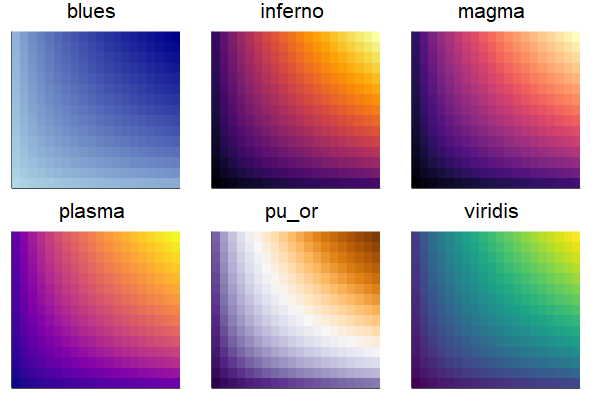
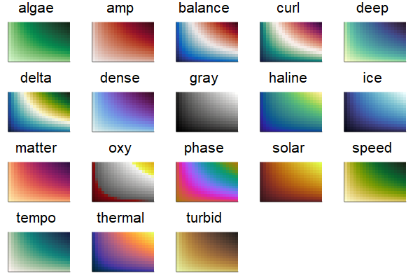
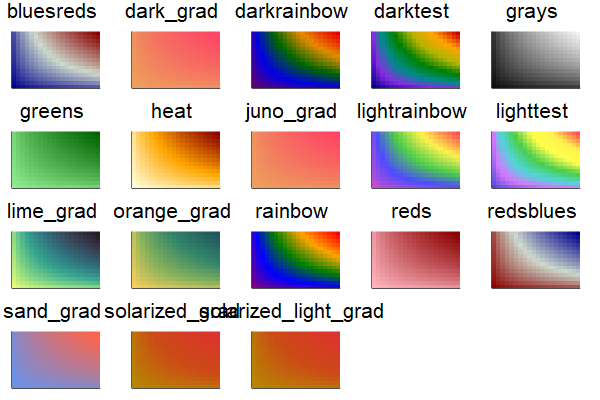
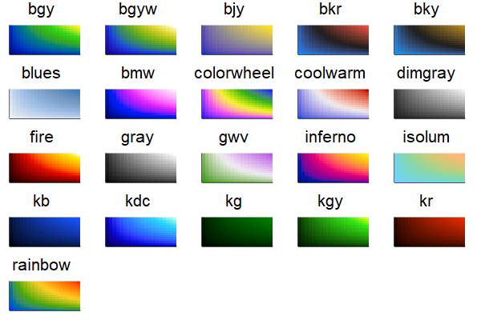

## Colors

There are many color attributes, for lines, fills, markers, backgrounds, and foregrounds.  Many colors follow a hierarchy... `linecolor` gets its value from `seriescolor`, for example, unless you override the value.  This allows for you to simply set precisely what you want, without lots of boilerplate.

Color attributes will accept many different types:

- `Symbol`s or `String`s will be passed to `Colors.parse(Colorant, c)`, so `:red` is equivalent to `colorant"red"`
- `false` or `nothing` will be converted to an invisible `RGBA(0,0,0,0)`
- Any `Colors.Colorant`, with or without alpha/opacity
- Any `Plots.ColorScheme`, which includes `ColorVector`, `ColorGradient`, etc

In addition, there is an extensive facility for selecting and generating color maps/gradients.

- A valid Symbol: `:inferno` (the default), `:heat`, `:blues`, etc
- A list of colors (or anything that can be converted to a color)
- A pre-built `ColorGradient`, which can be constructed with the `cgrad` helper function.  See [this short tutorial](https://github.com/tbreloff/ExamplePlots.jl/blob/master/notebooks/cgrad.ipynb) for example usage.

---

#### Series Colors

For series, there are a few attributes to know:

- **seriescolor**: Not used directly, but defines the base color for the series
- **linecolor**: Color of paths
- **fillcolor**: Color of area fill
- **markercolor**: Color of the interior of markers and shapes
- **markerstrokecolor**: Color of the border/stroke of markers and shapes

`seriescolor` defaults to `:auto`, and gets assigned a color from the `color_palette` based on its index in the subplot.  By default, the other colors `:match`.  (See the table below)

This color... | matches this color...
--- | ---
linecolor | seriescolor
fillcolor | seriescolor
markercolor | seriescolor
markerstrokecolor | foreground_color_subplot

Note: each of these attributes have a corresponding alpha override: `seriesalpha`, `linealpha`, `fillalpha`, `markeralpha`, and `markerstrokealpha`.  They are optional, and you can still give alpha information as part of an `Colors.RGBA`.

Note: in some contexts, and when the user hasn't set a value, the `linecolor` or `markerstrokecolor` may be overridden.

---

#### Foreground/Background

Foreground and background colors work similarly:

This color... | matches this color...
--- | ---
background_color_outside | background_color
background_color_subplot | background_color
background_color_legend  | background_color_subplot
background_color_inside  | background_color_subplot
foreground_color_subplot | foreground_color
foreground_color_legend  | foreground_color_subplot
foreground_color_grid    | foreground_color_subplot
foreground_color_title   | foreground_color_subplot
foreground_color_axis    | foreground_color_subplot
foreground_color_border  | foreground_color_subplot
foreground_color_guide   | foreground_color_subplot
foreground_color_text    | foreground_color_subplot

---

#### Misc

- `line_z` and `marker_z` parameters will map data values into a ColorGradient value
- `color_palette` determines the colors assigned when `seriescolor == :auto`:
    - If passed a vector of colors, it will force cycling of those colors
    - If passed a gradient, it will infinitely draw unique colors from that gradient, attempting to spread them out

---

#### Colorschemes
Color gradients are arranged into color libraries. To get a list of color libraries, use the `clibraries` function. To get a list of color gradients in each library, call `cgradients(library)`. `showlibrary(library)` creates a visual representation of color schemes. To change the active library, use `clibrary(library)`. This is only necessary in the case of namespace clashes, e.g. there are multiple `:blues`. The gradients can be reversed by appending `_r`, e.g. `:magma_r`. The `clims::NTuple{2,Number}` attribute can be used to define the data values that correspond with the ends of the schemes.

The following libraries and gradients are included in Plots:

##### Plots
*Created by Nathaniel J. Smith, Stefan van der Walt, and (in the case of viridis) Eric Firing. Released under CC0 license / public domain dedication. Full license info available [here]((https://github.com/JuliaPlots/PlotUtils.jl/blob/master/LICENSE.md#matplotlib)).*

##### cmocean
*Released under The MIT License (MIT) Copyright (c) 2015 Kristen M. Thyng. RGB values were taken from https://github.com/matplotlib/cmocean/tree/master/cmocean/rgb*

##### misc

##### colorcet
*Released under The MIT License (MIT) Copyright (c) 2015 Peter Kovesi. These are the perceptually correct color maps designed by Peter Kovesi and described in Peter Kovesi. Good Colour Maps: How to Design Them. arXiv:1509.03700 [cs.GR] 2015*

##### colorbrewer
*Created by Cynthia Brewer, Mark Harrower, and The Pennsylvania State University. Released under the Apache License, Version 2.0. Full license info available [here](https://github.com/JuliaPlots/PlotUtils.jl/blob/master/LICENSE.md#colorbrewer).*

