### Initialize

```julia
using Plots
pgfplots()
```

### Lines

A simple line plot of the columns.

```julia
plot(Plots.fakedata(50,5),w=3)
```

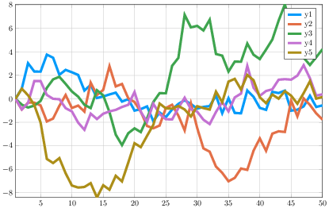

### Parametric plots

Plot function pair (x(u), y(u)).

```julia
plot(sin,(x->begin
            sin(2x)
        end),0,2π,line=4,leg=false,fill=(0,:orange))
```

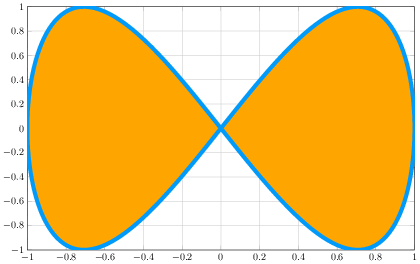

### Global

Change the guides/background/limits/ticks.  Convenience args `xaxis` and `yaxis` allow
you to pass a tuple or value which will be mapped to the relevant args automatically.
The `xaxis` below will be replaced with `xlabel` and `xlims` args automatically during
the preprocessing step. You can also use shorthand functions: `title!`, `xaxis!`,
`yaxis!`, `xlabel!`, `ylabel!`, `xlims!`, `ylims!`, `xticks!`, `yticks!`

```julia
y = rand(20,3)
plot(y,xaxis=("XLABEL",(-5,30),0:2:20,:flip),background_color=RGB(0.2,0.2,0.2),leg=false)
hline!(mean(y,1) + rand(1,3),line=(4,:dash,0.6,[:lightgreen :green :darkgreen]))
vline!([5,10])
title!("TITLE")
yaxis!("YLABEL",:log10)
```

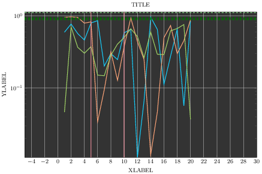

### Extra LaTeX packages

You can add LaTeX formating with support for additional LaTeX packages with
`LaTeXStrings.jl` and `PGFPlots.pushPGFPlotsPreamble`. For example, if we add the package
`amssymb`, we can get Blackboard bold symbols with the `\mathbb` control sequence:

```julia
using LaTeXStrings
PGFPlots.pushPGFPlotsPreamble("\\usepackage{amssymb}")
ylabel!(L"$\mathbb E[f(x)]$")
```

### Arguments

Plot multiple series with different numbers of points.  Mix arguments that apply to all
series (marker/markersize) with arguments unique to each series (colors).  Special
arguments `line`, `marker`, and `fill` will automatically figure out what arguments to
set (for example, we are setting the `linestyle`, `linewidth`, and `color` arguments with
`line`.)  Note that we pass a matrix of colors, and this applies the colors to each
series.

```julia
ys = Vector[rand(10),rand(20)]
plot(ys,color=[:black :orange],line=(:dot,4),marker=([:hex :d],12,0.8,stroke(3,:gray)))
```

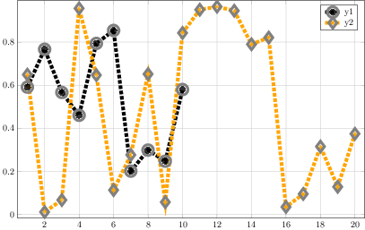

### Build plot in pieces

Start with a base plot...

```julia
plot(rand(100) / 3,reg=true,fill=(0,:green))
```

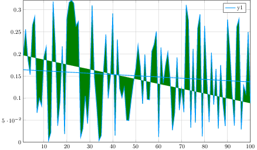

###

and add to it later.

```julia
scatter!(rand(100),markersize=6,c=:orange)
```

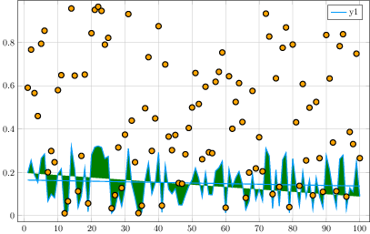

### Line types


```julia
linetypes = [:path :steppre :steppost :sticks :scatter]
n = length(linetypes)
x = Vector[sort(rand(20)) for i = 1:n]
y = rand(20,n)
plot(x,y,line=(linetypes,3),lab=map(string,linetypes),ms=15)
```

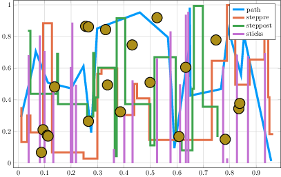

### Line styles


```julia
styles = setdiff(Plots.supported_styles(),[:auto])'
plot(cumsum(randn(20,length(styles)),1),style=:auto,label=map(string,styles),w=5)
```

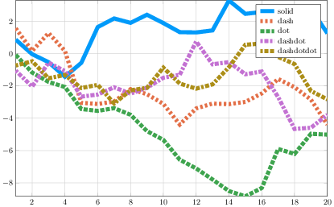

### Marker types


```julia
markers = setdiff(Plots.supported_markers(),[:none,:auto,Shape])'
n = length(markers)
x = (range(0, stop=10, length=n + 2))[2:end - 1]
y = repmat(reverse(x)',n,1)
scatter(x,y,m=(8,:auto),lab=map(string,markers),bg=:linen,xlim=(0,10),ylim=(0,10))
```

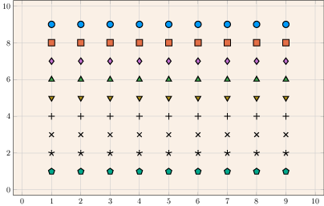

### Bar

x is the midpoint of the bar. (todo: allow passing of edges instead of midpoints)

```julia
bar(randn(99))
```

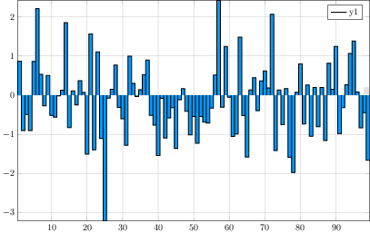

### Histogram


```julia
histogram(randn(1000),nbins=20)
```

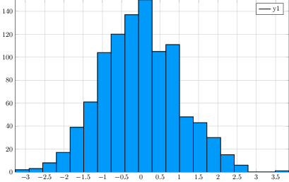

### Subplots

Use the `layout` keyword, and optionally the convenient `@layout` macro to generate
arbitrarily complex subplot layouts.


```julia
l = @layout([a{0.1h};b [c;d e]])
plot(randn(100,5),layout=l,
     t=[:line :histogram :scatter :steppre :bar],leg=false,ticks=nothing,border=false)
```

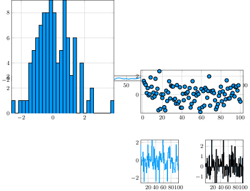

### Adding to subplots

Note here the automatic grid layout, as well as the order in which new series are added
to the plots.

```julia
plot(Plots.fakedata(100,10),layout=4,
     palette=[:grays :blues :heat :lightrainbow],
     bg_inside=[:orange :pink :darkblue :black])
```

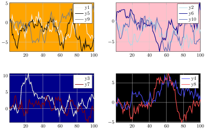

###


```julia
Random.seed!(111)
plot!(Plots.fakedata(100,10))
```


### Open/High/Low/Close

Create an OHLC chart.  Pass in a list of (open,high,low,close) tuples as your `y`
argument.  This uses recipes to first convert the tuples to OHLC objects, and
subsequently create a :path series with the appropriate line segments.

```julia
n = 20
hgt = rand(n) + 1
bot = randn(n)
openpct = rand(n)
closepct = rand(n)
y = OHLC[(openpct[i] * hgt[i] + bot[i],bot[i] + hgt[i],bot[i],closepct[i] * hgt[i] +
          bot[i]) for i = 1:n]
ohlc(y)
```

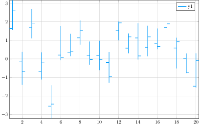

### Annotations

The `annotations` keyword is used for text annotations in data-coordinates.  Pass in a
tuple (x,y,text) or a vector of annotations.  `annotate!(ann)` is shorthand for `plot!(;
annotation=ann)`.  Series annotations are used for annotating individual data points.
They require only the annotation... x/y values are computed.  A `PlotText` object can be
build with the method `text(string, attr...)`, which wraps font and color attributes.

```julia
y = rand(10)
plot(y,annotations=(3,y[3],text("this is #3",:left)),leg=false)
annotate!([(5,y[5],text("this is #5",16,:red,:center)),
          (10,y[10],text("this is #10",:right,20,"courier"))])
scatter!(range(2, stop=8, length=6),rand(6),marker=(50,0.2,:orange),
         series_annotations=["series","annotations","map","to","series",
                             text("data",:green)])
```

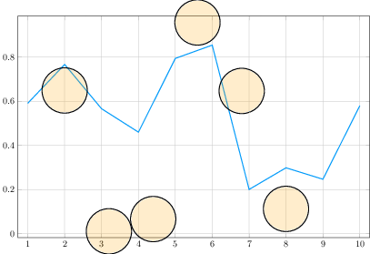

### Custom Markers

A `Plots.Shape` is a light wrapper around vertices of a polygon.  For supported backends,
pass arbitrary polygons as the marker shapes.  Note: The center is (0,0) and the size is
expected to be rougly the area of the unit circle.

```julia
verts =[(-1.0,1.0),(-1.28,0.6),(-0.2,-1.4),(0.2,-1.4),(1.28,0.6),(1.0,1.0),(-1.0,1.0),
        (-0.2,-0.6),(0.0,-0.2),(-0.4,0.6),(1.28,0.6),(0.2,-1.4),(-0.2,-1.4),(0.6,0.2),
        (-0.2,0.2),(0.0,-0.2),(0.2,0.2),(-0.2,-0.6)]
x = 0.1:0.2:0.9
y = 0.7 * rand(5) + 0.15
plot(x,y,line=(3,:dash,:lightblue),marker=(Shape(verts),30,RGBA(0,0,0,0.2)),bg=:pink,
     fg=:darkblue,xlim=(0,1),ylim=(0,1),leg=false)
```

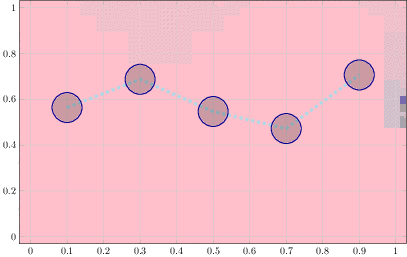

### 3D


```julia
n = 100
ts = range(0, stop=8π, length=n)
x = ts .* map(cos,ts)
y = (0.1ts) .* map(sin,ts)
z = 1:n
plot(x,y,z,zcolor=reverse(z),m=(10,0.8,:blues,stroke(0)),leg=false,cbar=true,w=5)
plot!(zeros(n),zeros(n),1:n,w=10)
```

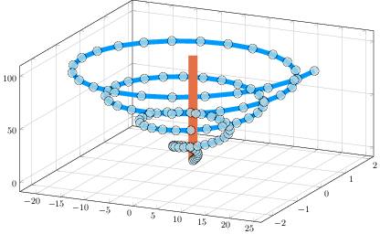

### DataFrames

Plot using DataFrame column symbols.

```julia
import RDatasets
iris = RDatasets.dataset("datasets","iris")
@df iris scatter(:SepalLength,:SepalWidth,group=:Species,title="My awesome plot",xlabel="Length",ylabel="Width",marker=(0.5,[:+ :h :star7],12),bg=RGB(0.2,0.2,0.2))
```

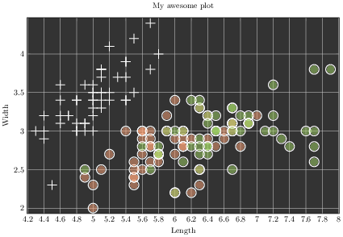

### Polar Plots


```julia
Θ = range(0, stop=1.5π, length=100)
r = abs(0.1 * randn(100) + sin(3Θ))
plot(Θ,r,proj=:polar,m=2)
```

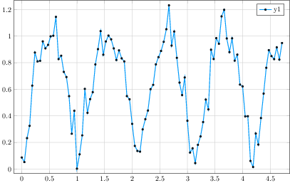

### Layouts, margins, label rotation, title location


```julia
plot(rand(100,6),layout=@layout([a b;c]),
     title=["A" "B" "C"],title_location=:left,
     left_margin=[20mm 0mm],bottom_margin=50px,xrotation=60)
```

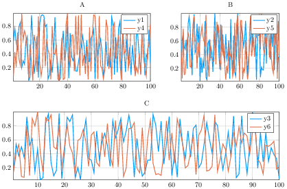

- Supported arguments: `aspect_ratio`, `background_color`, `background_color_inside`, `bins`, `color_palette`, `fillalpha`, `fillcolor`, `fillrange`, `foreground_color`, `grid`, `group`, `guidefont`, `label`, `layout`, `legend`, `legendfont`, `linealpha`, `linecolor`, `linestyle`, `linewidth`, `markeralpha`, `markercolor`, `markershape`, `markersize`, `markerstrokealpha`, `markerstrokecolor`, `markerstrokewidth`, `seriesalpha`, `seriescolor`, `seriestype`, `show`, `size`, `tickfont`, `title`, `x`, `xflip`, `xguide`, `xlims`, `xrotation`, `xscale`, `xticks`, `y`, `yflip`, `yguide`, `ylims`, `yrotation`, `yscale`, `yticks`, `z`, `zflip`, `zguide`, `zlims`, `zrotation`, `zscale`, `zticks`
- Supported values for axis: `:auto`, `:left`
- Supported values for linetype: `:contour`, `:histogram2d`, `:path`, `:path3d`, `:scatter`, `:stepmid`, `:steppost`, `:steppre`, `:xsticks`, `:ysticks`
- Supported values for linestyle: `:auto`, `:dash`, `:dashdot`, `:dashdotdot`, `:dot`, `:solid`
- Supported values for marker: `:auto`, `:cross`, `:diamond`, `:dtriangle`, `:circle`, `:none`, `:pentagon`, `:rect`, `:star5`, `:utriangle`, `:xcross`
- Is `subplot`/`subplot!` supported? No

(Automatically generated: 2016-06-09T17:39:13)
