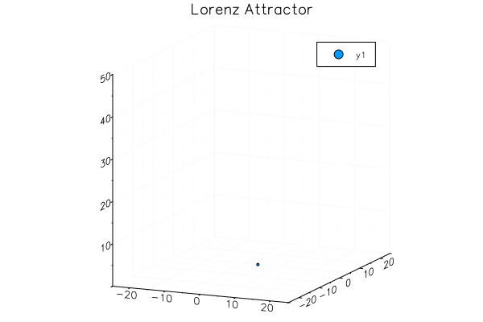
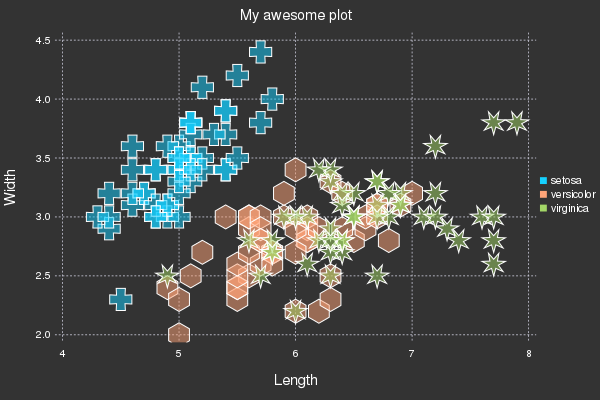

# Plots - powerful convenience for visualization in Julia

**Author: Thomas Breloff (@tbreloff)**

To get started, [see the tutorial](/tutorial).

Almost everything in Plots is done by specifying plot [attributes](/attributes).

Tap into the extensive visualization functionality enabled by the [Plots ecosystem](/ecosystem), and easily build your own complex graphics components with [recipes](/recipes).


## Intro to Plots in Julia

Data visualization has a complicated history.  Plotting software makes trade-offs between features and simplicity, speed and beauty, and a static and dynamic interface. Some packages make a display and never change it, while others make updates in real-time.

Plots is a visualization interface and toolset. It sits above other backends, like GR or PyPlot, connecting commands with implementation. If one backend does not support your desired features or make the right trade-offs, you can just switch to another backend with one command. No need to change your code. No need to learn a new syntax. Plots might be the last plotting package you ever learn.

My goals with the package are:

- **Powerful**.  Do more with less. Complex visualizations become easy.
- **Intuitive**.  Start generating plots without reading volumes of documentation. Commands should "just work."
- **Concise**.  Less code means fewer mistakes and more efficient development and analysis.
- **Flexible**.  Produce your favorite plots from your favorite package, only quicker and simpler.
- **Consistent**.  Don't commit to one graphics package. Use the same code and access the strengths of all [backends](/backends).
- **Lightweight**.  Very few dependencies, since backends are loaded and initialized dynamically.
- **Smart**.  It's not quite AGI, but Plots should figure out what you **want** it to do... not just what you **tell** it.

Use the [preprocessing pipeline](/pipeline) in Plots to describe your visualization completely before it calls the backend code.  This preprocessing maintains modularity and allows for efficient separation of front end code, algorithms, and backend graphics.

Please add wishlist items, bugs, or any other comments/questions to the [issues list](https://github.com/tbreloff/Plots.jl/issues), and [join the conversation on gitter](https://gitter.im/tbreloff/Plots.jl).

---

### Simple is Beautiful

Lorenz Attractor

```julia
# initialize the attractor
n = 1500
dt = 0.02
σ, ρ, β = 10., 28., 8/3
x, y, z = 1., 1., 1.

# initialize a 3D plot with 1 empty series
plt = path3d(1, xlim=(-25,25), ylim=(-25,25), zlim=(0,50),
                xlab = "x", ylab = "y", zlab = "z",
                title = "Lorenz Attractor", marker = 1)

# build an animated gif, saving every 10th frame
@gif for i=1:n
    dx = σ*(y - x)     ; x += dt * dx
    dy = x*(ρ - z) - y ; y += dt * dy
    dz = x*y - β*z     ; z += dt * dz
    push!(plt, x, y, z)
end every 10
```



Make some waves

```julia
using Plots, ProgressMeter
pyplot(leg=false, ticks=nothing)
x = y = linspace(-5, 5, 40)
zs = zeros(0,40)
n = 100

# create a progress bar for tracking the animation generation
prog = Progress(n,1)

@gif for i in linspace(0, 2π, n)
    f(x,y) = sin(x + 10sin(i)) + cos(y)

    # create a plot with 3 subplots and a custom layout
    l = @layout [a{0.7w} b; c{0.2h}]
    p = plot(x, y, f, st = [:surface, :contourf], layout=l)
    
    # induce a slight oscillating camera angle sweep, in degrees (azimuth, altitude)
    plot!(p[1],camera=(15*cos(i),40))

    # add a tracking line
    fixed_x = zeros(40)
    z = map(f,fixed_x,y)
    plot!(p[1], fixed_x, y, z, line = (:black, 5, 0.2))
    vline!(p[2], [0], line = (:black, 5))

    # add to and show the tracked values over time
    zs = vcat(zs, z')
    plot!(p[3], zs, alpha = 0.2, palette = cgrad(:blues).colors)
    
    # increment the progress bar
    next!(prog)
end
```


Iris Dataset

```julia
# load a dataset
using RDatasets
iris = dataset("datasets", "iris");

# load the StatPlots recipes (for DataFrames) available via:
# Pkg.add("StatPlots")
using StatPlots

# Scatter plot with some custom settings
scatter(iris, :SepalLength, :SepalWidth, group=:Species,
        title = "My awesome plot",
        xlabel = "Length", ylabel = "Width",
        m=(0.5, [:cross :hex :star7], 12),
        bg=RGB(.2,.2,.2))

# save a png
png("iris")
```



---
