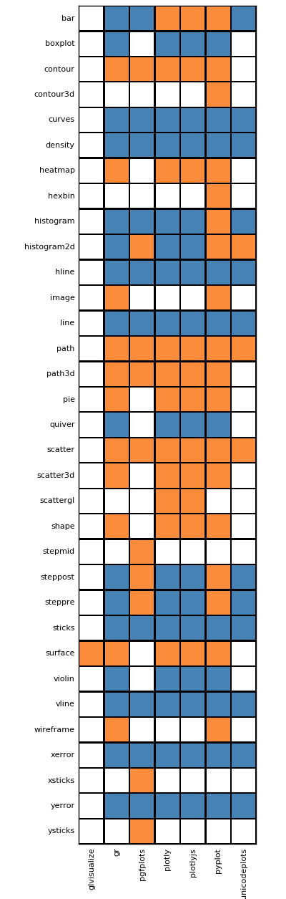
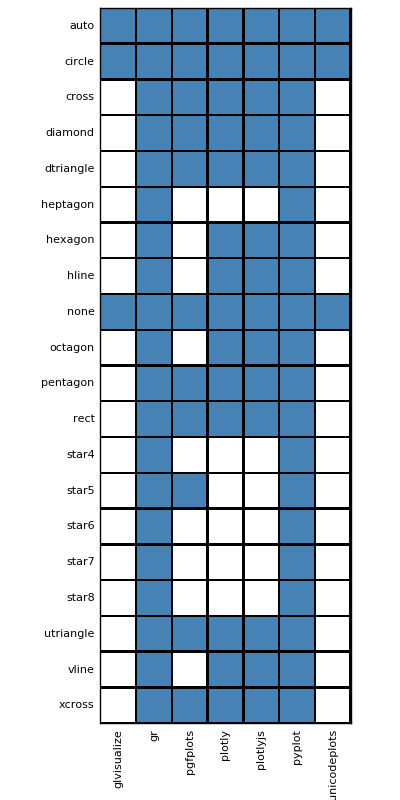
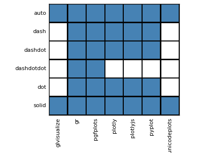
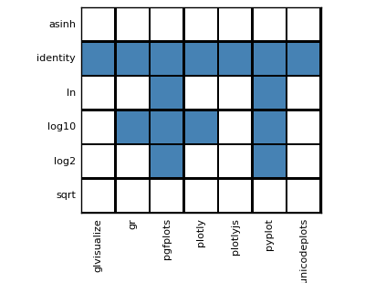

## Series Types

Key:

- **Orange**: the series type is natively supported by the backend.
- **Blue**: the series type is supported through series recipes.

## Keyword Arguments

## Markers

## Line styles

## Scales

